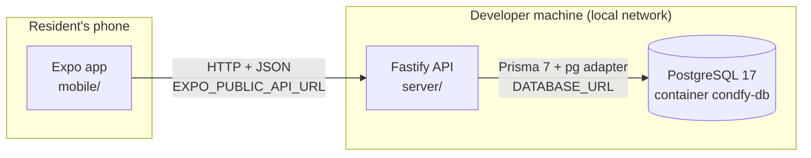

# condfy

Condominium management app: residents and administrators handle day-to-day condominium
life from their phones. The visitor module is the first one running end to end; the data foundation
for condominiums, units and user accounts is in place.

**Stack:** Expo SDK 57 · React Native 0.86 · Fastify 5 · Prisma 7 · PostgreSQL 17 · TypeScript 6 ·
**Status:** in development, authentication in place, local network only

## Documentation map

| Document | Answers |
|---|---|
| [Product](product.md) | What the system does, for whom, which modules exist, glossary |
| [Business rules](business-rules.md) | Every constraint the system enforces and where it lives |
| [Architecture](architecture.md) | How mobile, server and database fit together, and why |
| [API](api.md) | The HTTP contract between app and server |
| [Data model](data-model.md) | Tables, relationships and database-level integrity |
| [Development](development.md) | How to run it, conventions, common tasks, troubleshooting |
| [Decisions](decisions/README.md) | Architectural decisions and their trade-offs |

## One-screen overview

- **Two independent projects in one repository.** `mobile/` and `server/` have their own
  `package.json`, `tsconfig.json` and `node_modules`. The only contract between them is HTTP
  ([ADR 0001](decisions/0001-split-mobile-and-server.md)).
- **The phone never talks to the database.** Prisma and `DATABASE_URL` exist only in `server/`;
  the app only knows the API URL.
- **The database speaks English, the API speaks Portuguese.** Tables, columns and enums are
  English; the JSON contract keeps the Portuguese domain vocabulary the app already uses. The
  visitor service is the single translation point ([ADR 0006](decisions/0006-english-database-portuguese-contract.md)).
- **Integrity lives in the database.** Uniqueness, one-admin-per-condominium, normalized
  casing and "a resident must live in at least one unit" are enforced by constraints and triggers,
  not only by application code ([ADR 0004](decisions/0004-integrity-rules-in-the-database.md)).
- **Validation runs twice on purpose.** The app validates for a friendly error without spending
  the network; the server validates because it cannot trust its caller.
- **Sign-in is required, sign-up is open.** Visitor routes need a token; anyone who reaches the
  server can create an account and then see every visitor, because visitors still have no owner.
  That combination is only acceptable on a development network
  ([ADR 0007](decisions/0007-jwt-with-rotating-refresh-tokens.md)).
- **No automated tests.** Verification is manual, through type checks, lint and the scripted
  scenarios in [development.md](development.md#manual-verification).

## Planned work

- **Visitors will belong to a condominium and a unit.** Confirmed by the author on 2026-09-29.
  The `visitors` table predates the condominium model and has no link to it yet, so today every
  visitor is visible to every caller. A future feature adds the relationship; see the
  [gap](business-rules.md#inconsistencies-and-gaps-found) for what has to be decided along the
  way.

## Parked

- **Who registers condominiums and units in production.** Deliberately postponed by the author on
  2026-09-29. They exist only through the development seed for now.

## Open questions

- [ ] **What is the product's commercial shape?** Sold per condominium, per unit, or to
  administrators managing many condominiums? This affects the roles model (the administradora role
  was deliberately left out).
- [ ] **Do doormen need a different app experience?** They are a role in the data model, but no
  screen distinguishes them from residents.

---
Last updated: 2026-10-06 (the síndico creates places to book, with a required name, fee and photo — RN-RSV-14; creating a condominium, feature 013: the síndico as a third role, blocks and units, an uploaded photo — RN-CON-03 to RN-CON-05, RN-MEM-05, ADR 0017; the visitor pass, feature 012: a square with a QR code per visit, shared as a picture — RN-VIS-13, RN-VIS-14, ADR 0016; the administrator goes by "Administrator" in their condominium, and notices show who published them — RN-MEM-04; visitors by role: the administrator sees and authorizes for the whole condominium, a resident sees only the visits they authorized, and nobody removes a visit they did not authorize — RN-VIS-11, RN-VIS-12; administrator controls for a common area, feature 011: switching a place off and on, the whole day, and cancelling from the bookings of the day — RN-RSV-01, RN-RSV-11 to RN-RSV-13; the booking screen lists the bookings of the day, RN-RSV-07; lost and found: tapping an item opens its photo alone, RN-LAF-01)
