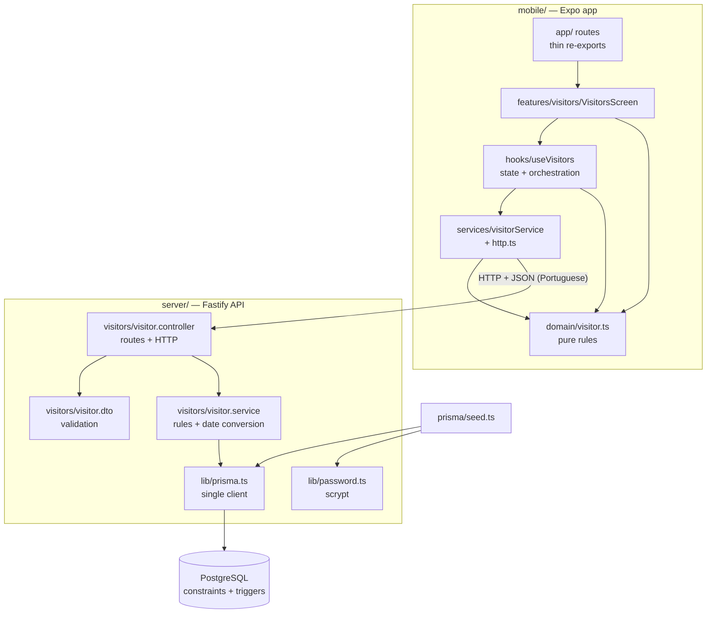
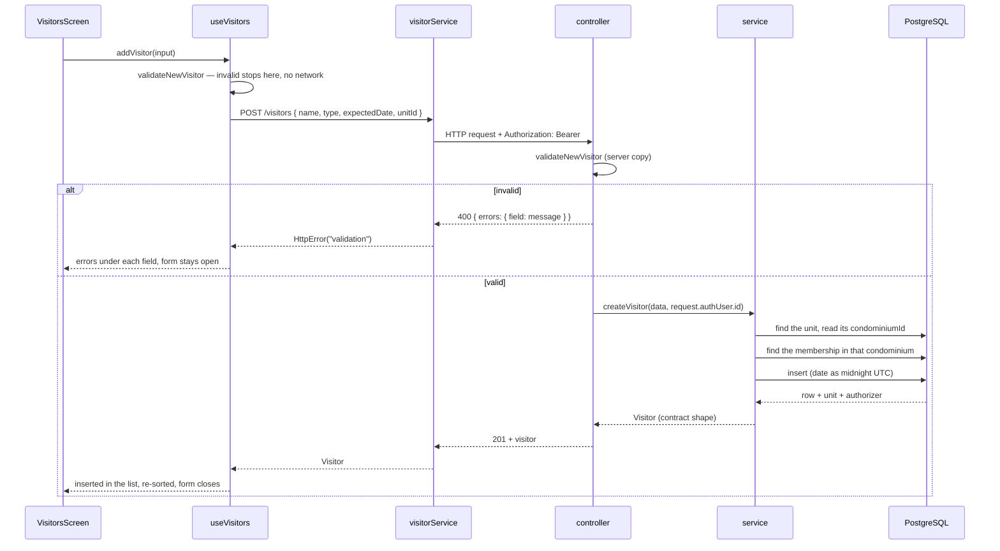

# Architecture

## Stack

| Layer | Technology | Version | Note |
|---|---|---|---|
| App | Expo SDK / React Native | 57 / 0.86.3 | Android, iOS and web from one codebase |
| App routing | expo-router | 57.0.21 | File-based routes, typed routes enabled |
| App language | TypeScript | ~6.0.3 | `strict`, `any` forbidden by the project constitution |
| Server | Fastify | 5.12 | Built-in JSON parsing, typing and pino logger |
| Server runtime | Node | 22+ (24.18 in development) | Runs `.ts` natively, no build step, no `tsx` |
| ORM | Prisma | 7.10 | Client generated into `server/generated/prisma` |
| DB driver | `@prisma/adapter-pg` + `pg` | 7.10 / 8.23 | Prisma 7 requires a driver adapter |
| Database | PostgreSQL | 17 | Container `condfy-db` via `docker-compose` |

Versions come from [mobile/package.json](../mobile/package.json),
[server/package.json](../server/package.json) and
[server/docker-compose.yml](../server/docker-compose.yml).

## Component view



Everything above the HTTP arrow runs on the resident's phone; everything below runs on the
developer's machine today, and on a server later. Nothing crosses that line except JSON.

## Code organization

```
mobile/
├── app/            expo-router routes: one file per URL, each re-exporting a feature screen
├── features/       one folder per functionality (visitors, home), each self-contained
└── shared/         components, lib and constants used by two or more features

server/
├── prisma/         schema, migrations and the development seed
├── generated/      Prisma Client output — generated, not versioned
└── src/
    ├── lib/        cross-cutting server pieces: prisma client, password hashing
    └── visitors/   one folder per resource: controller, service, dto
```

A feature in `mobile/features/<name>/` holds `components/`, `hooks/`, `services/`, `domain/`, the
screen and an `index.ts` that is its public surface. Dependencies flow one way —
`app/ → features/ → shared/` — and one feature imports another only through its `index.ts`
([ADR 0002](decisions/0002-feature-based-structure.md)).

On the server each resource follows controller → service → Prisma. The controller declares its own
routes and is the only layer that knows HTTP; the service never receives a request object, so the
same function serves routes, scripts and future tests. There is no repository layer: Prisma
already is one.

## Front-end

**Navigation.** [expo-router](https://docs.expo.dev/router/introduction/) maps files in
[mobile/app/](../mobile/app) to routes. `_layout.tsx` at the root declares a `Stack`;
there is no tab navigator — the home screen is the ordinary route `/`
([app/index.tsx](../mobile/app/index.tsx)) since feature 017, which removed the `(tabs)` group
([ADR 0022](decisions/0022-the-home-screen-has-no-tab-bar-and-composes-the-latest-notice.md)).
Route files are one line — [app/visitors.tsx](../mobile/app/visitors.tsx)
re-exports `@/features/visitors` — so screens live with their feature and the route file only
declares that the URL exists. The only guards are the two in the root layout, described below.

**Global state.** One context: `AuthProvider` in `features/auth`, holding the session as
`loading`, `anonymous` or `authenticated`. While it is `loading` no screen decides
anything, which is what stops the sign-in screen from flashing for someone who is already signed
in. The root layout redirects between the `(auth)` group and the rest based on that state.

The same layout also holds the **condominium gate**. The context derives `condominiumGate` —
`resolving`, `choose`, `failed` or `open` — from the profile and the selected condominium. While it
is `resolving` no route is rendered at all; while it is `choose` or `failed` the only routes allowed
are `/choose-condominium` and `/create-condominium` — the second because the chooser offers to
create a condominium, and its own button would otherwise bounce back to it. It lives in the root layout because that is the one place every route
passes through, so a direct link to a module is held as well as a tap
([ADR 0013](decisions/0013-the-current-condominium-is-chosen-once-and-is-never-a-permission.md)).
Features read which condominium is current — `selectedCondominiumId`, `currentMembership` — from
`@/features/auth`; none has a control of its own to change it.

Since feature 014 the layout holds a **password gate** as well, and it comes first. An account a
síndico created has `mustChoosePassword` until its owner replaces the provisional password; while
it is true the only route allowed is `/first-password`. Like the condominium gate it is courtesy on
the screen — the server answers `403` to everything else that account asks for
([ADR 0018](decisions/0018-a-provisional-account-carries-a-restriction-in-its-token.md)).

Since feature 016 there is a **third gate**, between those two: somebody who signed up and whose
request to join has not been answered has `pendingRequest`, and the only route allowed is
`/awaiting-approval`. The order is password, request, condominium.

The profile is also re-read, quietly, whenever the app returns to the foreground
(`refreshProfile`): that is how somebody removed from a condominium, or whose role was changed,
comes to see it without signing in again.

**Signing up** is the one place the app reads data without a session: the two lists of the
directory, fetched with `skipAuth` by `features/auth/services/directoryService.ts`. The three
choices live in `useSignUpForm`; the dropdown, `SelectField`, is written by hand and stays in
`features/auth/` until something else needs one. **The `joinRequests` feature** is the module of
whoever is in charge, "Requests" on the screen
([ADR 0021](decisions/0021-a-join-request-is-a-row-that-an-answer-deletes.md)).

**The `passCheck` feature** is the doorman's module, and the only place the app uses the camera
to read rather than to photograph. `usePassCheck` is a small state machine — `scanning` →
`checking` → `answered` or `failed`, and one touch back to `scanning` — because a camera reports
the QR code in front of it many times a second: a ref ignores every reading but the first, and a
sequence number drops an answer that belongs to a previous pass. A text that is not a Condfy pass
is answered on the device and never sent. `expo-camera` is imported by two files, both in this
feature ([ADR 0020](decisions/0020-reading-a-pass-needs-the-camera-and-records-the-entry.md)).

**The `staff` feature** is the síndico's module, "Roles" on the screen: `/staff` lists who holds a
role, `/staff/new` brings somebody in, `/staff/[userId]` changes a role, sets another provisional
password and removes. It is the first module on the home screen that belongs to one role
([modules.ts](../mobile/features/home/data/modules.ts)).

**Theming.** Colours are never read from a constant. `shared/constants/Colors.ts` holds two palettes
with the same keys, and `shared/theme/` carries the one in use through context. A component builds
its stylesheet from it, and this is the only way a component is styled:

```ts
const useStyles = makeStyles((colors) =>
  StyleSheet.create({ card: { backgroundColor: colors.cardBackground } })
);
// inside the component
const styles = useStyles();
const { colors } = useTheme();   // only for a colour outside a style, such as an icon's
```

Which palette is in use is decided by `AppearanceProvider` in `features/settings`, wrapped around
the whole app in the root layout — outside the session, so the sign-in screen is themed too. It
reads the person's choice from the device and, until there is one, follows the device's own
setting. `shared/theme/` does no I/O. Every `<Text>` and every icon takes its colour from the
palette; text with no colour is black, and black is invisible on dark
([ADR 0014](decisions/0014-colours-come-from-context-and-styles-are-made-from-the-palette.md)).

**There is no bottom bar.** Until feature 017 one held Home and a Sign out entry whose press was
intercepted; signing out is now a row of Settings.

**The home screen composes a card that belongs to another feature.** The latest-notice card and
the hook that finds the notice live in `features/newsletter` — they are made of the board's
`Notice` and its preview rule — and `HomeScreen` gets both through `@/features/newsletter`. The card
is always dark, by a nested `ThemeProvider scheme="dark"` whose styles are made inside it, the
mirror of the visitor pass. Its background, `mobile/assets/images/notice-card-waves.png`, is the
only image bundled with the app. Which modules are grid cards and which are full-width rows is the
`kind` each declares in `modules.ts`.

Apart from it, each screen still gets its state from its feature hook — the visitor list lives in
[useVisitors.ts](../mobile/features/visitors/hooks/useVisitors.ts). That hook models the
remote list as three exclusive states — `loading`, `erro`, `pronto` — plus independent flags
for a submission in flight (`enviando`, `erroEnvio`) and a removal in flight (`removendo`,
`erroRemocao`). When login arrives it will need shared state; that is the moment to reconsider
([ADR 0003](decisions/0003-fastify-and-native-typescript.md) discusses the related server choice).

**Talking to the API.** [http.ts](../mobile/features/auth/services/http.ts) is a small
`fetch` wrapper that now belongs to the auth feature: it prepends `EXPO_PUBLIC_API_URL`,
attaches the access token, serializes JSON, aborts after 10 seconds, and on a `401` renews once
and repeats the request — with a single shared renewal, so concurrent calls never rotate twice and
kill the session. Failures become a typed `HttpError` with four kinds: `network` (no answer or
timeout), `validation` (`400` carrying field errors), `session` (a `401` renewal could not
fix) and `server` (anything else). It produces no
user-facing text. [visitorService.ts](../mobile/features/visitors/services/visitorService.ts)
turns responses into domain objects, narrowing `unknown` through the type guards in
[domain/visitor.ts](../mobile/features/visitors/domain/visitor.ts). The hook decides the
message the resident reads. The client lives inside the feature because `shared/lib/` is reserved
for pure functions and `services/` is the only layer allowed to do I/O; it moves to `shared/` when
a second feature needs HTTP.

**Shared components.** [ConfirmDialog](../mobile/shared/components/ConfirmDialog.tsx) is a modal
built by hand instead of `Alert.alert`, because `Alert` does nothing on web and a removal would
then happen without confirmation. [DateField](../mobile/shared/components/DateField.tsx) is a
calendar input that holds no date logic of its own — every calculation comes from
[shared/lib/calendar.ts](../mobile/shared/lib/calendar.ts). Colors come from
[shared/constants/Colors.ts](../mobile/shared/constants/Colors.ts); there is no global stylesheet.

## Main flow: registering a visitor



The body names only the unit. The condominium comes from that unit and the authorizer comes from the
token, so neither can be chosen by the caller
([ADR 0009](decisions/0009-visitors-belong-to-a-unit-and-a-membership.md)). An unknown unit and a
unit in another condominium get the same `400`, so the API does not reveal which units exist.

The app does not reload the list after creating: it inserts the record the server returned and
re-sorts locally. Reloading would mean a second request that could fail after a successful save,
leaving the resident without the visitor they just registered.

## Cross-cutting concerns

- **Authentication:** e-mail and password, exchanged for a 15-minute JWT and a rotating renewal
  credential. The visitor routes require the token; a `preHandler` verifies it and puts the user
  id on the request, which is the only source of identity. See
  [Authentication and sessions](business-rules.md#authentication-and-sessions).
- **Authorization:** none yet. Roles exist in the database but nothing reads them: being signed in
  grants everything.
- **Validation:** duplicated on purpose between app and server, with identical messages, so the
  server's rejection lands under the right form field without any translation layer.
- **Error handling (server):** [server.ts](../server/src/server.ts) lets Fastify's own errors
  below `500` through (malformed JSON becomes `400`) and turns anything else into
  `500 { mensagem: "Internal server error." }`, logging the cause without the body.
- **Error handling (app):** all failures become one of the three `HttpError` kinds and then a
  message; the list never silently empties.
- **Logging:** Fastify's pino logger with default serializers — method, URL, status, duration.
  No request body, no personal data ([RN-USR-04](business-rules.md#rn-usr-04--personal-data-never-reaches-the-logs)).
- **CORS:** `@fastify/cors` allows `CORS_ORIGIN` (default `http://localhost:8081`, the Metro dev
  server). Only the web target is affected; Android and iOS do not send an `Origin`.
- **Timeouts:** 10 seconds per request, enforced by the app.
- **Themes:** the app must stay readable in light and dark mode (`userInterfaceStyle: automatic`).
- **i18n:** none. Interface text is English, domain vocabulary is Portuguese, both hardcoded.

## Decisions

| # | Decision |
|---|---|
| [0001](decisions/0001-split-mobile-and-server.md) | Split the repository into `mobile/` and `server/`, with HTTP as the only contract |
| [0002](decisions/0002-feature-based-structure.md) | Organize the app by feature instead of MVVM layers |
| [0003](decisions/0003-fastify-and-native-typescript.md) | Fastify plus Node's native TypeScript, with no build step |
| [0004](decisions/0004-integrity-rules-in-the-database.md) | Enforce integrity rules in PostgreSQL, not only in application code |
| [0005](decisions/0005-scrypt-for-passwords.md) | Hash passwords with `scrypt` from Node's standard library |
| [0006](decisions/0006-english-database-portuguese-contract.md) | English database, Portuguese API contract, translated in one place |
| [0007](decisions/0007-jwt-with-rotating-refresh-tokens.md) | Short-lived JWT plus an opaque rotating renewal credential |

## Risks and technical debt

- **Open sign-up with global visitors.** Authentication now exists, but anyone who reaches the
  server can create an account and then see every visitor of every condominium. Sign-up needs
  approval or invites before this is published, and credentials travel in clear text without
  HTTPS.
- **Visitors live outside the condominium model.** See
  [gaps](business-rules.md#inconsistencies-and-gaps-found). Any future "visitors of my
  condominium" query requires a migration and a decision about existing rows.
- **Duplicated validation drifts silently.** Nothing fails if
  [visitor.dto.ts](../server/src/visitors/visitor.dto.ts) and
  [domain/visitor.ts](../mobile/features/visitors/domain/visitor.ts) disagree; the app would
  simply show a server message that does not match its own rule.
- **No automated tests.** Every regression is caught by hand. The riskiest area is the date
  conversion, where an error is invisible until someone in another timezone looks at a card.
- **Generated Prisma client is a hard dependency of the build.** `server/generated/` is not
  versioned, so a fresh clone must run `npm run db:generate` before `npm run typecheck` or
  `npm run dev` will work.
- **The project constitution and the Spec Kit artifacts are not versioned.** `.specify/`,
  `specs/` and `.claude/` are in `.gitignore`, so the rules and the feature history that shaped
  this codebase exist only on the author's machine. This `docs/` folder is the only documentation
  that travels with the repository.
