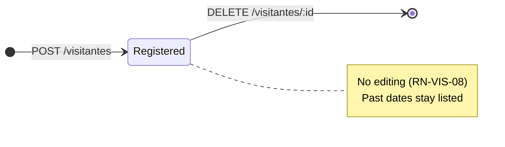

# Business rules

Every rule the system enforces today, where it is enforced, and what the user sees when it is
broken. Rules are grouped by domain and carry an identifier so commits and issues can cite them.

Two enforcement layers matter here:

- **App** (`mobile/`) validates to give a friendly error without spending the network.
- **Server** (`server/`) validates because it cannot trust its caller, and the **database**
  enforces what can be expressed as a constraint — see
  [ADR 0004](decisions/0004-integrity-rules-in-the-database.md).

---

## Visitors

The visitor form and its validation messages are in English, like the rest of the interface.

### RN-VIS-01 · A visitor needs a name of at most 60 characters

Surrounding spaces are trimmed before validating and before storing, so a name made only of
spaces counts as empty.

- **Where:** app — [visitante.ts](../mobile/features/visitors/domain/visitante.ts),
  `validarNovoVisitante`; server — [visitante.dto.ts](../server/src/visitors/visitante.dto.ts);
  database — column `name VARCHAR(60)` in [schema.prisma](../server/prisma/schema.prisma)
- **Message:** `Name is required.` / `Name must be at most 60 characters.`

### RN-VIS-02 · The visit type is one of three fixed values

`visitante` (a person), `entrega` (a delivery) or `prestador` (a service provider). The app shows
them as *Visitor*, *Delivery* and *Service*.

- **Where:** app — `TIPOS_VISITA` in
  [visitante.ts](../mobile/features/visitors/domain/visitante.ts); database — enum `VisitType`
  in [schema.prisma](../server/prisma/schema.prisma), which rejects any other value at insert time
- **Message:** `Select a visit type.`

### RN-VIS-03 · The expected date is a real calendar day

The date is a day, never a moment: no time, no timezone. `2026-02-31` is rejected because February
never has 31 days. Dates in the past are accepted — the system does not expire or clean up
visitors.

- **Where:** app — `ehDataISOValida` in [calendario.ts](../mobile/shared/lib/calendario.ts);
  server — its own copy in [visitante.dto.ts](../server/src/visitors/visitante.dto.ts);
  database — column `expected_date DATE`
- **Message:** `Expected date is required.` / `Enter a real date as DD/MM/YYYY.`

### RN-VIS-04 · The date the resident sees is the date that was registered

A visitor expected on the 14th shows the 14th on any device, in any timezone. The server converts
at the boundary: `"2026-09-14"` becomes midnight UTC on the way in, and the date is read back in
UTC on the way out.

- **Where:** [visitante.service.ts](../server/src/visitors/visitante.service.ts), `paraVisitante`
  and `criarVisitante`
- **Why it matters:** reading a `DATE` in local time is the classic off-by-one-day bug.

### RN-VIS-05 · The authorizing resident is required

Free text today; it is not linked to a user account.

- **Where:** app and server validation, as in RN-VIS-01
- **Message:** `Authorizing resident is required.`

### RN-VIS-06 · The list is ordered by expected date, nearest first

Ties are broken by creation order, then by id, so the order never shuffles between two loads. The
server sorts; the app re-sorts only when it inserts a newly created visitor into the list it
already has.

- **Where:** server — `listarVisitantes` in
  [visitante.service.ts](../server/src/visitors/visitante.service.ts); app —
  `ordenarPorDataPrevista` in [visitante.ts](../mobile/features/visitors/domain/visitante.ts)

### RN-VIS-07 · Removing a visitor twice is not an error

Deleting a visitor that no longer exists (already removed on another device) returns the same
success as deleting an existing one, and the app just refreshes its list.

- **Where:** server — `removerVisitante` uses `deleteMany` in
  [visitante.service.ts](../server/src/visitors/visitante.service.ts); the route answers `204`
  either way ([visitante.controller.ts](../server/src/visitors/visitante.controller.ts))

### RN-VIS-08 · Visitors cannot be edited

There is no update route and no edit screen, by product decision. Fixing a wrong record means
removing it and registering it again.

- **Where:** absence of `PUT`/`PATCH` in
  [visitante.controller.ts](../server/src/visitors/visitante.controller.ts)

### RN-VIS-09 · A visitor only appears after the server confirms it

The app never shows an optimistic card. While the request is in flight the confirm button is
disabled, which also prevents a double tap from creating two visitors.

- **Where:** `adicionarVisitante` in
  [useVisitantes.ts](../mobile/features/visitors/hooks/useVisitantes.ts) (the `enviandoRef` guard)

### RN-VIS-10 · A failed load never looks like an empty list

If the list cannot be fetched, the screen shows a failure message and a *Try again* button. The
"no visitors yet" message is reserved for a successful, genuinely empty response.

- **Where:** `lista` state in [useVisitantes.ts](../mobile/features/visitors/hooks/useVisitantes.ts);
  rendering in [VisitorsScreen.tsx](../mobile/features/visitors/VisitorsScreen.tsx)
- **Message:** `Couldn't load visitors. Check your connection and try again.`

---

## Condominiums, units and people

None of these rules is reachable from the app yet: they are enforced on whatever writes to the
database, including the seed script. Most live in the migration rather than in TypeScript.

### RN-CON-01 · A condominium needs a non-empty, trimmed name

Two condominiums may share the same name; they are told apart by id.

- **Where:** `CHECK condominiums_name_check` in
  [create_users_condominiums migration](../server/prisma/migrations/20260929040409_create_users_condominiums/migration.sql)

### RN-CON-02 · A condominium with units or members cannot be deleted

Foreign keys from `units` and `condominium_members` use `ON DELETE RESTRICT`.

- **Where:** same migration, foreign key section

### RN-UNI-01 · A unit is unique within its condominium

Block plus number must not repeat in the same condominium, and units without a block must not
repeat the number either. The same "A 101" may exist in another condominium.

- **Where:** unique indexes `units_condominium_id_block_number_key` and the partial index
  `units_number_without_block_key` (`WHERE block IS NULL`) in the migration
- **Why two indexes:** in SQL, `NULL` never equals `NULL`, so a plain unique index would allow
  unlimited unit "12" rows with no block ([ADR 0004](decisions/0004-integrity-rules-in-the-database.md))

### RN-UNI-02 · Block and number are stored uppercase and trimmed

`a 101` and `A 101` are the same unit. Instead of comparing case-insensitively, the database
refuses to store anything that is not already normalized, so uniqueness is exact.

- **Where:** `CHECK units_number_check` and `units_block_check` in the migration
- **Consequence:** whoever writes must normalize first — the database rejects, it does not fix.

### RN-UNI-03 · A unit with residents cannot be deleted

- **Where:** `unit_residents` foreign key with `ON DELETE RESTRICT`

### RN-USR-01 · One account per e-mail, stored lowercase and trimmed

E-mails are unique across the whole system, not per condominium, and must look like an e-mail
(`local@domain.tld`).

- **Where:** `users_email_key` unique index and `CHECK users_email_check` (lowercase, trimmed,
  format) in the migration

### RN-USR-02 · The password is never stored in a readable or reversible form

Only a `scrypt` derivation is stored, in the format `scrypt$N$r$p$salt$hash`, which records the
parameters used so they can be hardened later without invalidating existing passwords. A wrong
format never verifies.

- **Where:** [password.ts](../server/src/lib/password.ts), `hashPassword` and `verifyPassword`
- **See also:** [ADR 0005](decisions/0005-scrypt-for-passwords.md)

### RN-USR-03 · Deleting a user deletes everything about them

Memberships and residency rows cascade; the e-mail becomes available again. There is no
"deactivated" state.

- **Where:** `ON DELETE CASCADE` on `condominium_members.user_id` and on the membership foreign
  key of `unit_residents`

### RN-USR-04 · Personal data never reaches the logs

Names and e-mails must not be written to server logs or app logs. The Fastify logger records
method, URL, status and duration, never the request body; the seed prints counts only.

- **Where:** [server.ts](../server/src/server.ts) (default serializers) and
  [seed.ts](../server/prisma/seed.ts)

### RN-MEM-01 · One membership per user and condominium, carrying exactly one role

The primary key is the pair (user, condominium), so a second membership in the same condominium is
impossible by construction.

- **Where:** `@@id([userId, condominiumId])` in [schema.prisma](../server/prisma/schema.prisma)

### RN-MEM-02 · At most one manager per condominium

A second `manager` membership is rejected. Having no manager is allowed.

- **Where:** partial unique index `condominium_members_one_manager_key`
  (`WHERE role = 'manager'`) in the migration

### RN-MEM-03 · Removing a membership removes that person's residency in that condominium

- **Where:** `unit_residents` references the membership, not the user directly, with
  `ON DELETE CASCADE`

### RN-RES-01 · A resident only lives in units of a condominium they belong to

Residency points at the membership and at the unit through two composite foreign keys that share
the same `condominium_id`, so a mismatch cannot be inserted.

- **Where:** `unit_residents_user_id_condominium_id_fkey` and
  `unit_residents_unit_id_condominium_id_fkey` in the migration; model `UnitResident` in
  [schema.prisma](../server/prisma/schema.prisma)

### RN-RES-02 · Every resident lives in at least one unit

Checked at the end of each transaction, not at each statement, so a membership and its first
residency can be created together. A transaction that ends with a resident without a unit is
rolled back. Managers and doormen may live in a unit but are not required to.

- **Where:** function `enforce_resident_has_unit` and the two
  `CONSTRAINT TRIGGER ... DEFERRABLE INITIALLY DEFERRED` in the migration
- **Message (database):** `A resident must live in at least one unit of the condominium.`

---

## Entity lifecycles

Condominiums, units, users, memberships and residency have no state machine: they exist or they
do not. What is restricted is *deletion* (RN-CON-02, RN-UNI-03) and *cascade* (RN-USR-03,
RN-MEM-03).

---

## Inconsistencies and gaps found

- **Visitors are not attached to a condominium or a unit yet.** The `visitors` table has no
  `condominium_id`, no unit and no link to the user who authorized the visit — `authorized_by` is
  free text. The module predates the condominium model, so today every visitor is visible to every
  client of the API. This is the largest gap between the two halves of the data model.

  The author confirmed on 2026-09-29 that visitors **will** be linked to a condominium and a unit.
  Questions that the feature doing it has to answer: whether the link is the unit alone (the
  condominium being reachable through it) or both columns; whether `authorized_by` becomes a
  foreign key to the authorizing resident, which would also enforce
  [RN-RES-01](#rn-res-01--a-resident-only-lives-in-units-of-a-condominium-they-belong-to); and
  what happens to the rows already registered, which have no condominium to point at.
- **The same validation lives in two files by design.** The rules in
  [visitante.ts](../mobile/features/visitors/domain/visitante.ts) (app) and
  [visitante.dto.ts](../server/src/visitors/visitante.dto.ts) (server) must be changed together,
  including the message text — the app shows the server's message under the right field. The
  server file carries a comment pointing at the app file.
- **One server-side rule is unreachable from the interface.** The name field has
  `maxLength={60}`, so the app cannot produce the "at most 60 characters" rejection from the
  server; only a direct API call can.
- **`visitors.updated_at` is never meaningful.** Visitors cannot be edited (RN-VIS-08), so the
  column only ever equals `created_at`.
- **Roles are stored but never checked.** Nothing in the app or API reads `role` yet; any caller
  can do anything (see [risks](architecture.md#risks-and-technical-debt)).
