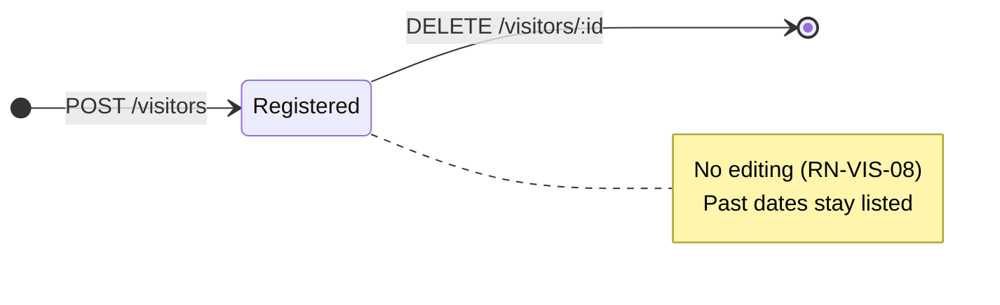

# Business rules

Every rule the system enforces today, where it is enforced, and what the user sees when it is
broken. Rules are grouped by domain and carry an identifier so commits and issues can cite them.

Two enforcement layers matter here:

- **App** (`mobile/`) validates to give a friendly error without spending the network.
- **Server** (`server/`) validates because it cannot trust its caller, and the **database**
  enforces what can be expressed as a constraint — see
  [ADR 0004](decisions/0004-integrity-rules-in-the-database.md).

---

## Visitors

The visitor form and its validation messages are in English, like the rest of the interface.

### RN-VIS-01 · A visitor needs a name of at most 60 characters

Surrounding spaces are trimmed before validating and before storing, so a name made only of
spaces counts as empty.

- **Where:** app — [visitor.ts](../mobile/features/visitors/domain/visitor.ts),
  `validateNewVisitor`; server — [visitor.dto.ts](../server/src/visitors/visitor.dto.ts);
  database — column `name VARCHAR(60)` in [schema.prisma](../server/prisma/schema.prisma)
- **Message:** `Name is required.` / `Name must be at most 60 characters.`

### RN-VIS-02 · The visit type is one of three fixed values

`visitor` (a person), `delivery` or `service_provider`. The app shows them as *Visitor*,
*Delivery* and *Service*. Contract and database use the same three values.

- **Where:** app — `TIPOS_VISITA` in
  [visitor.ts](../mobile/features/visitors/domain/visitor.ts); database — enum `VisitType`
  in [schema.prisma](../server/prisma/schema.prisma), which rejects any other value at insert time
- **Message:** `Select a visit type.`

### RN-VIS-03 · The expected date is a real calendar day

The date is a day, never a moment: no time, no timezone. `2026-02-31` is rejected because February
never has 31 days. Dates in the past are accepted — the system does not expire or clean up
visitors.

- **Where:** app — `ehDataISOValida` in [calendar.ts](../mobile/shared/lib/calendar.ts);
  server — its own copy in [visitor.dto.ts](../server/src/visitors/visitor.dto.ts);
  database — column `expected_date DATE`
- **Message:** `Expected date is required.` / `Enter a real date as DD/MM/YYYY.`

### RN-VIS-04 · The date the resident sees is the date that was registered

A visitor expected on the 14th shows the 14th on any device, in any timezone. The server converts
at the boundary: `"2026-09-14"` becomes midnight UTC on the way in, and the date is read back in
UTC on the way out.

- **Where:** [visitor.service.ts](../server/src/visitors/visitor.service.ts), `toVisitor`
  and `createVisitor`
- **Why it matters:** reading a `DATE` in local time is the classic off-by-one-day bug.

### RN-VIS-05 · The authorizing resident is required

Free text today; it is not linked to a user account.

- **Where:** app and server validation, as in RN-VIS-01
- **Message:** `Authorizing resident is required.`

### RN-VIS-06 · The list is ordered by expected date, nearest first

Ties are broken by creation order, then by id, so the order never shuffles between two loads. The
server sorts; the app re-sorts only when it inserts a newly created visitor into the list it
already has.

- **Where:** server — `listVisitors` in
  [visitor.service.ts](../server/src/visitors/visitor.service.ts); app —
  `sortByExpectedDate` in [visitor.ts](../mobile/features/visitors/domain/visitor.ts)

### RN-VIS-07 · Removing a visitor twice is not an error

Deleting a visitor that no longer exists (already removed on another device) returns the same
success as deleting an existing one, and the app just refreshes its list.

- **Where:** server — `removeVisitor` uses `deleteMany` in
  [visitor.service.ts](../server/src/visitors/visitor.service.ts); the route answers `204`
  either way ([visitor.controller.ts](../server/src/visitors/visitor.controller.ts))

### RN-VIS-08 · Visitors cannot be edited

There is no update route and no edit screen, by product decision. Fixing a wrong record means
removing it and registering it again.

- **Where:** absence of `PUT`/`PATCH` in
  [visitor.controller.ts](../server/src/visitors/visitor.controller.ts)

### RN-VIS-09 · A visitor only appears after the server confirms it

The app never shows an optimistic card. While the request is in flight the confirm button is
disabled, which also prevents a double tap from creating two visitors.

- **Where:** `addVisitor` in
  [useVisitors.ts](../mobile/features/visitors/hooks/useVisitors.ts) (the `submittingRef` guard)

### RN-VIS-10 · A failed load never looks like an empty list

If the list cannot be fetched, the screen shows a failure message and a *Try again* button. The
"no visitors yet" message is reserved for a successful, genuinely empty response.

- **Where:** `lista` state in [useVisitors.ts](../mobile/features/visitors/hooks/useVisitors.ts);
  rendering in [VisitorsScreen.tsx](../mobile/features/visitors/VisitorsScreen.tsx)
- **Message:** `Couldn't load visitors. Check your connection and try again.`

---

## Condominiums, units and people

None of these rules is reachable from the app yet: they are enforced on whatever writes to the
database, including the seed script. Most live in the migration rather than in TypeScript.

### RN-CON-01 · A condominium needs a non-empty, trimmed name

Two condominiums may share the same name; they are told apart by id.

- **Where:** `CHECK condominiums_name_check` in
  [create_users_condominiums migration](../server/prisma/migrations/20260929040409_create_users_condominiums/migration.sql)

### RN-CON-02 · A condominium with units or members cannot be deleted

Foreign keys from `units` and `condominium_members` use `ON DELETE RESTRICT`.

- **Where:** same migration, foreign key section

### RN-UNI-01 · A unit is unique within its condominium

Block plus number must not repeat in the same condominium, and units without a block must not
repeat the number either. The same "A 101" may exist in another condominium.

- **Where:** unique indexes `units_condominium_id_block_number_key` and the partial index
  `units_number_without_block_key` (`WHERE block IS NULL`) in the migration
- **Why two indexes:** in SQL, `NULL` never equals `NULL`, so a plain unique index would allow
  unlimited unit "12" rows with no block ([ADR 0004](decisions/0004-integrity-rules-in-the-database.md))

### RN-UNI-02 · Block and number are stored uppercase and trimmed

`a 101` and `A 101` are the same unit. Instead of comparing case-insensitively, the database
refuses to store anything that is not already normalized, so uniqueness is exact.

- **Where:** `CHECK units_number_check` and `units_block_check` in the migration
- **Consequence:** whoever writes must normalize first — the database rejects, it does not fix.

### RN-UNI-03 · A unit with residents cannot be deleted

- **Where:** `unit_residents` foreign key with `ON DELETE RESTRICT`

### RN-USR-01 · One account per e-mail, stored lowercase and trimmed

E-mails are unique across the whole system, not per condominium, and must look like an e-mail
(`local@domain.tld`).

- **Where:** `users_email_key` unique index and `CHECK users_email_check` (lowercase, trimmed,
  format) in the migration

### RN-USR-02 · The password is never stored in a readable or reversible form

Only a `scrypt` derivation is stored, in the format `scrypt$N$r$p$salt$hash`, which records the
parameters used so they can be hardened later without invalidating existing passwords. A wrong
format never verifies.

- **Where:** [password.ts](../server/src/lib/password.ts), `hashPassword` and `verifyPassword`
- **See also:** [ADR 0005](decisions/0005-scrypt-for-passwords.md)

### RN-USR-03 · Deleting a user deletes everything about them

Memberships and residency rows cascade; the e-mail becomes available again. There is no
"deactivated" state.

- **Where:** `ON DELETE CASCADE` on `condominium_members.user_id` and on the membership foreign
  key of `unit_residents`

### RN-USR-04 · Personal data never reaches the logs

Names and e-mails must not be written to server logs or app logs. The Fastify logger records
method, URL, status and duration, never the request body; the seed prints counts only.

- **Where:** [server.ts](../server/src/server.ts) (default serializers) and
  [seed.ts](../server/prisma/seed.ts)

### RN-MEM-01 · One membership per user and condominium, carrying exactly one role

The primary key is the pair (user, condominium), so a second membership in the same condominium is
impossible by construction.

- **Where:** `@@id([userId, condominiumId])` in [schema.prisma](../server/prisma/schema.prisma)

### RN-MEM-02 · At most one admin per condominium

A second `admin` membership is rejected. Having no admin is allowed. The rule is inherited from the
síndico, an elected individual; whether a management company may have several people is open.

- **Where:** partial unique index `condominium_members_one_admin_key`
  (`WHERE role = 'admin'`) in the migration

### RN-MEM-03 · Removing a membership removes that person's residency in that condominium

- **Where:** `unit_residents` references the membership, not the user directly, with
  `ON DELETE CASCADE`

### RN-RES-01 · A resident only lives in units of a condominium they belong to

Residency points at the membership and at the unit through two composite foreign keys that share
the same `condominium_id`, so a mismatch cannot be inserted.

- **Where:** `unit_residents_user_id_condominium_id_fkey` and
  `unit_residents_unit_id_condominium_id_fkey` in the migration; model `UnitResident` in
  [schema.prisma](../server/prisma/schema.prisma)

### RN-RES-02 · Every resident lives in at least one unit

Checked at the end of each transaction, not at each statement, so a membership and its first
residency can be created together. A transaction that ends with a resident without a unit is
rolled back. Managers and doormen may live in a unit but are not required to.

- **Where:** function `enforce_resident_has_unit` and the two
  `CONSTRAINT TRIGGER ... DEFERRABLE INITIALLY DEFERRED` in the migration
- **Message (database):** `A resident must live in at least one unit of the condominium.`

---

## Authentication and sessions

### RN-AUT-01 · Signing in never reveals which e-mails exist

A wrong password and an unknown e-mail get the same message and the same response time — the
server hashes a throwaway password when the account does not exist, so the delay matches.

- **Where:** `signIn` in [auth.service.ts](../server/src/auth/auth.service.ts)
- **Message:** `E-mail or password is incorrect.`
- **Known exception:** signing up must say when an e-mail is already in use (RN-AUT-08), which
  does expose existence. Closing that would require e-mail confirmation, deliberately out of scope.

### RN-AUT-02 · Five failures block sign-in for 15 minutes

Counted on two axes at once — the e-mail and the request origin — and whichever hits the limit
first blocks. During the block, even the correct password is refused, so the block never confirms
a guess. A successful sign-in clears the e-mail counter; the origin counter stays.

- **Where:** `checkLockout`, `recordFailure` and `clearFailures` in
  [auth.service.ts](../server/src/auth/auth.service.ts); table `login_attempts`
- **Message:** `Too many attempts. Try again in a few minutes.` with `Retry-After`
- **Why both axes:** only by e-mail, anyone could lock someone else's account on purpose; only by
  origin, an attacker who changes IP walks through.

### RN-AUT-03 · Using the app keeps you signed in; 30 days away ends it

The access credential lasts 15 minutes and is renewed silently. Each renewal issues a renewal
credential with a **new** 30-day deadline, so opening the app at least once a month means never
typing the password again. Thirty days without opening it, and the credential expires.

- **Where:** `issueCredentials` and `refresh` in
  [auth.service.ts](../server/src/auth/auth.service.ts); `refresh_tokens.expires_at`

### RN-AUT-04 · Reusing a renewal credential signs the person out everywhere

Each renewal revokes the credential it replaces. Presenting an already-revoked one means someone
holds a copy, so **every** renewal credential of that user is revoked — every device. The person
signs in again, and the thief's copy is worthless.

The swap is atomic: the update filters on `revoked_at IS NULL`, so two simultaneous renewals with
the same credential race in the database and exactly one wins. The loser takes the reuse path.

- **Where:** `refresh` and `revokeAllForUser` in
  [auth.service.ts](../server/src/auth/auth.service.ts)
- **Cost accepted:** a lost response followed by a retry looks exactly like a copy, and signs the
  person out of every device. The app renews once at a time, which avoids causing it itself.

### RN-AUT-05 · The access token carries identity and nothing else

`sub`, `iat`, `exp` — and nothing else. No role, no condominium, no unit: a token never goes stale
because something changed elsewhere, and the API never has to trust a claim about permissions.
Confirmed on 2026-10-02 by decoding a token returned by `POST /sessions`.

There is no `iss` and no `aud` either, on purpose. One API signs and verifies with one secret, so an
issuer claim would only be checked against itself; it starts paying off when a second service or a
second environment shares the key. Worth knowing before changing this: adding `{ issuer: … }` to the
verify options without also signing it would reject every token already issued.

Why identity and nothing else, concretely: a person can belong to **more than one** condominium with
a different role in each, and can live in more than one unit of the same condominium — the example
data covers both cases on purpose. So there is no single condominium or unit that could go in a
token. And a permission baked into one could not be withdrawn before it expired, since verifying a
token never touches the database (RN-AUT-06 caps that window at 15 minutes). Endpoints that need a
condominium read it from the resource or from the path, and check the membership against the
database each time ([ADR 0009](decisions/0009-visitors-belong-to-a-unit-and-a-membership.md)).

- **Where:** `signAccessToken` in [auth.controller.ts](../server/src/auth/auth.controller.ts), using
  the plugin registered in [server.ts](../server/src/server.ts)

### RN-AUT-06 · A deleted account keeps access for at most 15 minutes

Verifying the token does not touch the database, so the access credential stays valid until it
expires. Renewal is refused immediately, which caps the window at one cycle.

- **Where:** [authenticate.ts](../server/src/auth/authenticate.ts); the cascade from
  `users` to `refresh_tokens`

### RN-AUT-07 · Signing out works without a network

The app erases the credentials from the device first, then tells the server. If that call fails,
it is forgotten: the orphan credential dies by expiry or on the first reuse attempt (RN-AUT-04).

- **Where:** `signOut` in [useAuth.tsx](../mobile/features/auth/hooks/useAuth.tsx) and in
  [auth.service.ts](../server/src/auth/auth.service.ts)

### RN-AUT-08 · An account is created without a condominium

Sign-up asks for name, e-mail and password, and signs the person in. It creates no membership, no
role and no residency: linking a person to a condominium is a later feature. A `resident`
membership without a unit would be refused by the database anyway
([RN-RES-02](#rn-res-02--every-resident-lives-in-at-least-one-unit)).

- **Where:** `signUp` in [auth.service.ts](../server/src/auth/auth.service.ts)
- **Messages:** `This e-mail is already in use.` · `Enter a valid e-mail.` ·
  `Password must be at least 8 characters.`
- **Risk accepted:** sign-up is open and visitors are still global, so anyone who reaches the
  server can create an account and see every visitor. Acceptable only on a development network;
  before publishing, sign-up needs approval by an admin or an invite.

---

## Entity lifecycles

Condominiums, units, users, memberships and residency have no state machine: they exist or they
do not. What is restricted is *deletion* (RN-CON-02, RN-UNI-03) and *cascade* (RN-USR-03,
RN-MEM-03).

---

## Common areas and reservations

### RN-RSV-01 · A place is hidden by switching it off, never by deleting it

`is_available = false` removes a common area from the catalogue and keeps the row, its name and its
reservations. A condominium closes the party room for renovation and brings it back untouched. The
database refuses to delete a place that has reservations (`Restrict`), so switching off is the only
path that does not lose history.

From the resident's side, a condominium whose places are all switched off is indistinguishable from
one with nothing registered — both show the same empty state.

- **Where:** `listCommonAreas` in [commonArea.service.ts](../server/src/condominiums/commonArea.service.ts)

### RN-RSV-02 · You only ever see the catalogue of a condominium you belong to

The endpoint checks the caller's membership before reading anything, and answers `404` for an unknown
condominium, a condominium the caller does not belong to, and an id that is not a uuid — all with the
same body, so the API never reveals which condominiums exist.

A person who belongs to more than one condominium chooses which one they are looking at; the choice
is remembered on the device and re-validated against their memberships on every open. It is a
convenience, never a permission: what they may see is decided by the server, every time.

- **Where:** `listCommonAreas` and `useCommonAreas` in
  [useCommonAreas.ts](../mobile/features/reservations/hooks/useCommonAreas.ts)

### RN-RSV-03 · A reservation is a time slot inside one day, and has no state

A reservation stores a date, a start and an end, as minutes after midnight. Four rules are enforced
by the database rather than by code: it ends after it starts, it never crosses midnight, it is never
zero-length, and it can only exist for a place in a condominium the person belongs to.

It carries **no status**. The row's existence is the booking, and releasing a slot deletes it. The
consequence, accepted deliberately: the system cannot say who booked a place and gave it up.

**Nothing creates a reservation yet.** The table and its guarantees exist so that the shape was
decided before any screen depended on it; the booking flow is a later feature.

- **Where:** `reservations_minutes_check` in
  [the migration](../server/prisma/migrations/20261004161156_add_common_areas_and_reservations/migration.sql)

## Newsletter

### RN-NWS-01 · The board is read by everyone in the condominium

Every member sees the same notices, whatever their role, and nobody sees the notices of a
condominium they do not belong to. Newest first, with the id breaking ties so the order is stable
between visits.

The list carries the full text of every notice; the two-line preview is a rendering limit, not a
transport one, which is why opening a notice costs no request.

- **Where:** `listNotices` in [notice.service.ts](../server/src/condominiums/notice.service.ts)

### RN-NWS-02 · Only the administrator publishes, and the API is what enforces it

A notice may be published only by the `admin` of that condominium. The app hides the action from
everyone else, and that is a courtesy: the rule is enforced where the request arrives, so a resident
who reaches the operation by other means is still refused.

The refusal differs by membership on purpose. A member who is not the administrator gets **403** —
she reads this board daily, and pretending the condominium does not exist would be a lie. Someone
who is not a member at all gets the same **404** the read route gives, so existence stays hidden
from outsiders ([ADR 0010](decisions/0010-permission-rules-live-in-the-service.md)).

Who published is recorded and never shown: the board speaks for the condominium, not for a person.

- **Where:** `publishNotice` in [notice.service.ts](../server/src/condominiums/notice.service.ts)

### RN-NWS-03 · Paragraph breaks survive, and the body is the one text that is not trimmed

A notice body keeps its line breaks from the form through to the detail screen, because a wall of
run-together text is not an acceptable rendering of an announcement. That is why the body is the
only text column in the project not required to equal its trimmed form — trimming would eat the
blank line between two paragraphs. It still cannot be only whitespace, and it cannot exceed 5000
characters.

The list flattens those breaks for the preview only, so the two lines are two lines of content
rather than one line and an ellipsis.

- **Where:** `notices_body_check` in the migration, and `previewOf` in
  [notice.ts](../mobile/features/newsletter/domain/notice.ts)

## Inconsistencies and gaps found

- **~~Visitors are not attached to a condominium or a unit~~ — closed on 2026-10-02.** A visit now
  carries `unit_id`, `condominium_id` and `authorized_by_id`, held together by two composite foreign
  keys ([ADR 0009](decisions/0009-visitors-belong-to-a-unit-and-a-membership.md)). Whoever authorizes
  needs a membership in the condominium, not a residence in the unit, so an admin can
  authorize too. The single row that existed was deleted, as the author authorized.

  What the link does **not** do yet: `GET /visitors` still returns every condominium's visitors, and
  `DELETE /visitors/:id` still deletes anyone's. The schema makes scoping possible; deciding what each
  role may see and delete belongs to the resident feature. Both are marked `TODO` in
  [visitor.service.ts](../server/src/visitors/visitor.service.ts).
- **The app's visitor form has not caught up.** `POST /visitors` now requires `unitId` and rejects the
  old free-text `authorizedBy`, so creating a visitor from the app fails until
  [VisitorFormModal](../mobile/features/visitors/components/VisitorFormModal.tsx) sends a unit, and
  reading one fails until the guards in
  [visitor.ts](../mobile/features/visitors/domain/visitor.ts) expect the new `unit` and
  `authorizedBy` objects.
- **The app and the server disagree about `VisitType`.** The app still spells two of the three values
  in Portuguese — `"entrega"` and `"prestador"` ([visitor.ts](../mobile/features/visitors/domain/visitor.ts)) —
  while the database and the API use `delivery` and `service_provider`. The English rename
  ([ADR 0008](decisions/0008-english-everywhere.md)) missed them. Neither typecheck catches it,
  because the two sides are independent type universes. Creating a delivery from the app is rejected
  with `400`, and a single delivery row in the database makes the app's whole list fail its guard.
  The label maps in
  [VisitorCard](../mobile/features/visitors/components/VisitorCard.tsx) and `VisitorFormModal` are
  keyed by the stale values too. **The seed now creates such rows**, so this is no longer latent.
- **The same validation lives in two files by design.** The rules in
  [visitor.ts](../mobile/features/visitors/domain/visitor.ts) (app) and
  [visitor.dto.ts](../server/src/visitors/visitor.dto.ts) (server) must be changed together,
  including the message text — the app shows the server's message under the right field. The
  server file carries a comment pointing at the app file.
- **One server-side rule is unreachable from the interface.** The name field has
  `maxLength={60}`, so the app cannot produce the "at most 60 characters" rejection from the
  server; only a direct API call can.
- **`visitors.updated_at` is never meaningful.** Visitors cannot be edited (RN-VIS-08), so the
  column only ever equals `created_at`.
- **One route refuses by role; every other one does not.** Publishing a notice is checked against
  the caller's role (RN-NWS-02), and that is the only such check in the API. Everywhere else, any
  authenticated account may call any route — an `admin` reaching `/visitors` directly is still
  served, and the home screen hiding that module from them is presentation only. Hiding a module is
  not a permission (see [risks](architecture.md#risks-and-technical-debt)).
- **Validation is duplicated for accounts too**, between
  [sessao.ts](../mobile/features/auth/domain/session.ts) and
  [auth.dto.ts](../server/src/auth/auth.dto.ts), with the same message text.
