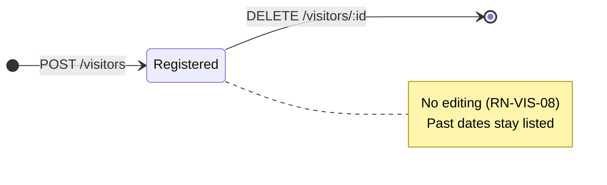

# Business rules

Every rule the system enforces today, where it is enforced, and what the user sees when it is
broken. Rules are grouped by domain and carry an identifier so commits and issues can cite them.

Two enforcement layers matter here:

- **App** (`mobile/`) validates to give a friendly error without spending the network.
- **Server** (`server/`) validates because it cannot trust its caller, and the **database**
  enforces what can be expressed as a constraint — see
  [ADR 0004](decisions/0004-integrity-rules-in-the-database.md).

---

## Visitors

The visitor form and its validation messages are in English, like the rest of the interface.

### RN-VIS-01 · A visitor needs a name of at most 60 characters

Surrounding spaces are trimmed before validating and before storing, so a name made only of
spaces counts as empty.

- **Where:** app — [visitor.ts](../mobile/features/visitors/domain/visitor.ts),
  `validateNewVisitor`; server — [visitor.dto.ts](../server/src/visitors/visitor.dto.ts);
  database — column `name VARCHAR(60)` in [schema.prisma](../server/prisma/schema.prisma)
- **Message:** `Name is required.` / `Name must be at most 60 characters.`

### RN-VIS-02 · The visit type is one of three fixed values

`visitor` (a person), `delivery` or `service_provider`. The app shows them as *Visitor*,
*Delivery* and *Service*. Contract and database use the same three values.

- **Where:** app — `TIPOS_VISITA` in
  [visitor.ts](../mobile/features/visitors/domain/visitor.ts); database — enum `VisitType`
  in [schema.prisma](../server/prisma/schema.prisma), which rejects any other value at insert time
- **Message:** `Select a visit type.`

### RN-VIS-03 · The expected date is a real calendar day

The date is a day, never a moment: no time, no timezone. `2026-02-31` is rejected because February
never has 31 days. Dates in the past are accepted — the system does not expire or clean up
visitors.

- **Where:** app — `ehDataISOValida` in [calendar.ts](../mobile/shared/lib/calendar.ts);
  server — its own copy in [visitor.dto.ts](../server/src/visitors/visitor.dto.ts);
  database — column `expected_date DATE`
- **Message:** `Expected date is required.` / `Enter a real date as DD/MM/YYYY.`

### RN-VIS-04 · The date the resident sees is the date that was registered

A visitor expected on the 14th shows the 14th on any device, in any timezone. The server converts
at the boundary: `"2026-09-14"` becomes midnight UTC on the way in, and the date is read back in
UTC on the way out.

- **Where:** [visitor.service.ts](../server/src/visitors/visitor.service.ts), `toVisitor`
  and `createVisitor`
- **Why it matters:** reading a `DATE` in local time is the classic off-by-one-day bug.

### RN-VIS-05 · The authorizing resident is required

Free text today; it is not linked to a user account.

- **Where:** app and server validation, as in RN-VIS-01
- **Message:** `Authorizing resident is required.`

### RN-VIS-06 · The list is ordered by expected date, nearest first

Ties are broken by creation order, then by id, so the order never shuffles between two loads. The
server sorts; the app re-sorts only when it inserts a newly created visitor into the list it
already has.

- **Where:** server — `listVisitors` in
  [visitor.service.ts](../server/src/visitors/visitor.service.ts); app —
  `sortByExpectedDate` in [visitor.ts](../mobile/features/visitors/domain/visitor.ts)

### RN-VIS-07 · Removing a visitor twice is not an error

Deleting a visitor that no longer exists (already removed on another device) returns the same
success as deleting an existing one, and the app just refreshes its list.

- **Where:** server — `removeVisitor` uses `deleteMany` in
  [visitor.service.ts](../server/src/visitors/visitor.service.ts); the route answers `204`
  either way ([visitor.controller.ts](../server/src/visitors/visitor.controller.ts))

### RN-VIS-08 · Visitors cannot be edited

There is no update route and no edit screen, by product decision. Fixing a wrong record means
removing it and registering it again.

- **Where:** absence of `PUT`/`PATCH` in
  [visitor.controller.ts](../server/src/visitors/visitor.controller.ts)

### RN-VIS-09 · A visitor only appears after the server confirms it

The app never shows an optimistic card. While the request is in flight the confirm button is
disabled, which also prevents a double tap from creating two visitors.

- **Where:** `addVisitor` in
  [useVisitors.ts](../mobile/features/visitors/hooks/useVisitors.ts) (the `submittingRef` guard)

### RN-VIS-10 · A failed load never looks like an empty list

If the list cannot be fetched, the screen shows a failure message and a *Try again* button. The
"no visitors yet" message is reserved for a successful, genuinely empty response.

- **Where:** `lista` state in [useVisitors.ts](../mobile/features/visitors/hooks/useVisitors.ts);
  rendering in [VisitorsScreen.tsx](../mobile/features/visitors/VisitorsScreen.tsx)
- **Message:** `Couldn't load visitors. Check your connection and try again.`

### RN-VIS-11 · Only the administrator sees other people's visitors, and nobody removes a visitor they did not authorize

What a person sees in the visitor list depends on their role in that condominium:

- the **administrator** sees every visit of the condominium, to any unit and authorized by anyone
  — and so do the síndico (RN-MEM-05) and, since feature 015, the **doorman**, for whom it is the
  gate's notebook: past, today's and future;
- a **resident** sees only the visits they authorized themselves — not those of a neighbour, and
  not those of somebody they live with.

Every card says **who authorized** the visit and **for which unit**, with the block and the number.
On the administrator's list that is what tells one visit from another.

**Seeing is not removing.** A **doorman** removes nothing and registers nothing — the screen offers
them no way to, and they are refused by any other route. That holds even for a visit they
authorized themselves as administrator before the síndico changed their role: on those cards too
there is no remove control and no pass.

A visit is removed only by whoever authorized it. The administrator
sees everybody's and can delete only their own; on the others the card has no remove control at
all. A removal aimed at somebody else's visit deletes nothing and answers as if the visit were
already gone (RN-VIS-07), so it reveals nothing.

The screen does not work this out by comparing people: each visit arrives saying whether the
person looking may remove it.

The role is per condominium. Somebody who administers one building and lives in another sees
everything in the first and only their own in the second.

- **Where:** `visibleTo`, `toVisitor` (`canRemove`) and `removeVisitor` in
  [visitor.service.ts](../server/src/visitors/visitor.service.ts);
  [VisitorCard.tsx](../mobile/features/visitors/components/VisitorCard.tsx)

### RN-VIS-12 · The administrator authorizes visitors too, for any unit

The administrator has the Visitors module and registers a visitor like a resident does, except for
the unit: a resident chooses among the units they live in, the administrator among **all** the units
of the condominium. The visit is recorded as authorized by the administrator, so it is theirs to
remove — and the residents of that unit do **not** see it, since a resident sees only what they
authorized themselves (RN-VIS-11).

The list of units is given only to the administrator; a resident asking for it is refused (`403`).

- **Where:** `listUnits` in [unit.service.ts](../server/src/condominiums/unit.service.ts),
  `useVisitors` in [useVisitors.ts](../mobile/features/visitors/hooks/useVisitors.ts), and
  [modules.ts](../mobile/features/home/data/modules.ts)

### RN-VIS-13 · Every visit has a pass with a code of its own, and only who authorized it gets the code

Each registered visit has one **pass**, from the moment it is registered until it is removed, and
one **code** that belongs to it alone. Two visits never share a code — not even two visits of the
same person on the same day.

The code is generated by the **database**, not by the API, so it holds for every writer. It never
changes: the pass opened or shared any number of times carries the same code. It cannot be worked
out from the visitor's name, the date or another code, and it is removed with the visit — there is
no separate "revoke".

The code is sent **only to whoever authorized the visit**. The administrator sees every visit of
the condominium and receives the code of none but their own, so they cannot open somebody else's
pass. It is the same line that decides who may remove a visit (RN-VIS-11), and the screen does not
compare people to draw it: a card opens a pass when a code arrived with it.

What a scan returns is `condfy:pass:` followed by the code. No name, no date, nothing personal.

- **Where:** `pass_code` in the
  [migration](../server/prisma/migrations/20261006231458_add_visitor_pass_code/migration.sql),
  `toVisitor` in [visitor.service.ts](../server/src/visitors/visitor.service.ts), and `passQrValue`
  in [visitor.ts](../mobile/features/visitors/domain/visitor.ts)

### RN-VIS-14 · The pass opens on registering, is shared as a picture, and is valid for the day of the visit

When a visitor is registered the pass opens by itself; a failed registration opens nothing. It
opens again from the visitor's card.

The pass is a square that says, in this order: a greeting to the visitor by name; who authorizes
their entry and to which condominium — a resident by name, the administrator as "Administrator"
(RN-MEM-04); the day it is valid; the QR code; and the Condfy mark. It shows no unit: a picture
that gets forwarded should not say where somebody lives.

Under the square there is a **Share** button, which hands the pass to the device's own sharing
options as **one picture of the whole pass and nothing else**. The picture is always the same light
design, whatever appearance the app is in. The app sends it nowhere by itself. Where a device cannot
share a picture, the picture is saved instead and the person is told.

A pass is valid for the **expected day of the visit** and no other. Once that day has passed, the
pass says it is no longer valid and cannot be shared.

**The doorman reads the code** with the camera (RN-GAT-01). The pass did not change for that: its
code already identified one visit, so a pass shared before the reader existed reads like any other.
The label on the pass itself — valid, or no longer valid — is still worked out on the device and
decides nothing; at the gate the answer is the server's.

- **Where:** [VisitorPass.tsx](../mobile/features/visitors/components/VisitorPass.tsx),
  [VisitorPassModal.tsx](../mobile/features/visitors/components/VisitorPassModal.tsx),
  [passSharing.ts](../mobile/features/visitors/services/passSharing.ts), `isPassExpired` in
  [visitor.ts](../mobile/features/visitors/domain/visitor.ts);
  [ADR 0016](decisions/0016-the-visitor-pass-is-a-picture-made-on-the-device.md)

---

## Condominiums, units and people

None of these rules is reachable from the app yet: they are enforced on whatever writes to the
database, including the seed script. Most live in the migration rather than in TypeScript.

### RN-CON-01 · A condominium needs a non-empty, trimmed name

Two condominiums may share the same name; they are told apart by id.

- **Where:** `CHECK condominiums_name_check` in
  [create_users_condominiums migration](../server/prisma/migrations/20260929040409_create_users_condominiums/migration.sql)

### RN-CON-03 · Whoever belongs to no condominium creates one, once, and becomes its síndico

**Only somebody who belongs to no condominium may create one, and so a síndico has exactly one.**
Creating is what makes a person a síndico; a resident, an administrator or a doorman of any
condominium cannot create one, and a síndico cannot create a second. Until 2026-10-07 anybody
signed in could, any number of times.

Two things enforce it, and both are needed. The service refuses an account that already has a
membership of **any** role. And a unique index allows a person one `manager` membership — which is
what stops two creations sent by the same account at the same moment, since both would pass the
first check. A refusal is a `409`, not a field error: nothing typed was wrong.

A person creates a condominium from the app with four things: its **name** (up to 100
characters), its **address** (free text, up to 200), its **blocks** and, optionally, a **photo**.
Whoever creates it becomes its **síndico** (RN-MEM-05). There is no approval and nothing checks that
the person really runs that building; two condominiums may share a name (RN-CON-01).

The offer appears on the home screen of an account that belongs to no condominium, as a button the
person can leave alone — and nowhere else. The condominium chooser had the same offer until this
rule; whoever reaches the chooser belongs to two or more condominiums. After creating, the person
is taken straight into the new condominium.

Creation is **all or nothing**: the condominium, every unit of every block and the membership of the
síndico are written together or not at all. A new condominium starts with one member — its síndico.
Nothing lets a resident join one from the app yet.

Nothing about a condominium can be changed afterwards yet.

- **Where:** `createCondominium` in
  [condominium.service.ts](../server/src/condominiums/condominium.service.ts); the partial unique
  index `condominium_members_one_condominium_per_manager_key`; and
  [useCreateCondominium.ts](../mobile/features/condominiums/hooks/useCreateCondominium.ts)
- **Message:** `You already belong to a condominium, so you cannot create one.`
- **Not decided:** how a person comes to run a second building. Today they would need a second
  account.
- **Since feature 016** the account that can create a condominium is no longer produced by signing
  up, which is for residents. It is created outside the app, with `npm run account:create`. And an
  account with a pending request to join cannot create one: `Your request to join a condominium is
  still pending.`

### RN-CON-04 · A condominium is created with at least one block, each with a code of one or two letters

The síndico adds as many blocks as they want, up to 50, and at least one. Each block has a **code**
of one or two letters from A to Z, stored in upper case whatever was typed — digits, accents and
symbols are refused — and unique inside the condominium. Each block also has a **number of units**,
from 1 to 500, and a condominium has at most 2000 units in all.

The units of a block are created numbered from 1: block "A" of 40 units has A-1 to A-40. A building
without blocks is registered as one block.

**The two-letter rule is in the validation, not in the database** — the opposite of the habit of
this project. Condominiums that existed before have blocks called `T1` and units with no block,
and they keep working; a CHECK would refuse them. The rule is about what the form creates.

- **Where:** `validateNewCondominium` in
  [condominium.dto.ts](../server/src/condominiums/condominium.dto.ts) and in
  [newCondominium.ts](../mobile/features/condominiums/domain/newCondominium.ts) — mirrored, change
  both together

### RN-CON-05 · The photo of a condominium is optional, uploaded from the device, and its size is advice

The form takes a photo from the camera or the gallery and states the recommended size, 1200 × 675
pixels (16:9), which fits the home banner. That is advice: a photo of another size is accepted and
cropped to fit. Without a photo the condominium shows the placeholder.

The photo must be a JPEG, PNG or WebP of at most 5 MB; the server decides the type from the bytes.
It is stored in the database and served through a path signed for 24 hours, outside the session
group — the mechanism of found items
([ADR 0012](decisions/0012-files-live-in-the-database-and-are-served-by-signed-paths.md)). **No
query selects the bytes of the photo** except the route that serves them.

A condominium now gets its picture from an uploaded photo or, in the sample data, from an `https`
address; one function in the app turns the two into one address.

- **Where:** `readCondominiumPhoto` and `signedPhotoPathOf` in
  [condominium.service.ts](../server/src/condominiums/condominium.service.ts),
  [condominiumPhoto.controller.ts](../server/src/condominiums/condominiumPhoto.controller.ts), and
  [condominiumPhoto.ts](../mobile/features/auth/services/condominiumPhoto.ts)

### RN-CON-02 · A condominium with units or members cannot be deleted

Foreign keys from `units` and `condominium_members` use `ON DELETE RESTRICT`.

- **Where:** same migration, foreign key section

### RN-UNI-01 · A unit is unique within its condominium

Block plus number must not repeat in the same condominium, and units without a block must not
repeat the number either. The same "A 101" may exist in another condominium.

- **Where:** unique indexes `units_condominium_id_block_number_key` and the partial index
  `units_number_without_block_key` (`WHERE block IS NULL`) in the migration
- **Why two indexes:** in SQL, `NULL` never equals `NULL`, so a plain unique index would allow
  unlimited unit "12" rows with no block ([ADR 0004](decisions/0004-integrity-rules-in-the-database.md))

### RN-UNI-02 · Block and number are stored uppercase and trimmed

`a 101` and `A 101` are the same unit. Instead of comparing case-insensitively, the database
refuses to store anything that is not already normalized, so uniqueness is exact.

- **Where:** `CHECK units_number_check` and `units_block_check` in the migration
- **Consequence:** whoever writes must normalize first — the database rejects, it does not fix.

### RN-UNI-03 · A unit with residents cannot be deleted

- **Where:** `unit_residents` foreign key with `ON DELETE RESTRICT`

### RN-USR-01 · One account per e-mail, stored lowercase and trimmed

E-mails are unique across the whole system, not per condominium, and must look like an e-mail
(`local@domain.tld`).

- **Where:** `users_email_key` unique index and `CHECK users_email_check` (lowercase, trimmed,
  format) in the migration

### RN-USR-02 · The password is never stored in a readable or reversible form

Only a `scrypt` derivation is stored, in the format `scrypt$N$r$p$salt$hash`, which records the
parameters used so they can be hardened later without invalidating existing passwords. A wrong
format never verifies.

- **Where:** [password.ts](../server/src/lib/password.ts), `hashPassword` and `verifyPassword`
- **See also:** [ADR 0005](decisions/0005-scrypt-for-passwords.md)

### RN-USR-03 · Deleting a user deletes everything about them

Memberships and residency rows cascade; the e-mail becomes available again. There is no
"deactivated" state.

- **Where:** `ON DELETE CASCADE` on `condominium_members.user_id` and on the membership foreign
  key of `unit_residents`

### RN-USR-04 · Personal data never reaches the logs

Names and e-mails must not be written to server logs or app logs. The Fastify logger records
method, URL, status and duration, never the request body; the seed prints counts only.

- **Where:** [server.ts](../server/src/server.ts) (default serializers) and
  [seed.ts](../server/prisma/seed.ts)

### RN-MEM-01 · One membership per user and condominium, carrying exactly one role

The primary key is the pair (user, condominium), so a second membership in the same condominium is
impossible by construction.

- **Where:** `@@id([userId, condominiumId])` in [schema.prisma](../server/prisma/schema.prisma)

### RN-MEM-02 · At most one administrator and at most one síndico per condominium

A second `admin` membership is rejected, and so is a second `manager`. The two limits are
independent: a condominium may have one administrator **and** one síndico, who are different people
because a membership carries one role. Having neither is allowed. Whether a management company may
have several administrators was open until feature 014, when the product owner settled it: **still
one**. To replace the administrator the síndico removes the current one and appoints another
(RN-STF-02). Doormen have no limit.

The limit also runs the other way for the síndico: **a person is the síndico of at most one
condominium** (RN-CON-03). An administrator has no such limit.

- **Where:** partial unique indexes `condominium_members_one_admin_key` (`WHERE role = 'admin'`)
  and `condominium_members_one_manager_key` (`WHERE role = 'manager'`), both on the condominium;
  and `condominium_members_one_condominium_per_manager_key`, on the person

### RN-MEM-03 · Removing a membership removes that person's residency in that condominium

- **Where:** `unit_residents` references the membership, not the user directly, with
  `ON DELETE CASCADE`

### RN-MEM-04 · The administrator goes by "Administrator" in the condominium they administer

Wherever a person's name is shown inside a condominium they administer, it reads **Administrator**
instead of their own name: at the top of their home screen, as who authorized a visitor, and as who
published a notice. Residents never see the administrator's personal name there.

It follows the role, which is per condominium and per moment:

- the same person shows their own name in a condominium where they are a resident;
- it is the role **now** that counts, not the one at the time — a notice published by somebody who
  is no longer the administrator shows that person's name;
- that includes somebody who **no longer belongs to the condominium at all** but whose account
  still exists. When the síndico removes a person the account is normally deleted and their
  notices pass to the síndico (RN-STF-04); this case is the exception described there.

Two places keep the real name on purpose: the person's own Settings, which show their account as it
is, and the sign-in data. The profile route is not changed; the home screen swaps what it shows.

- **Where:** `displayNameOf` in [displayName.ts](../server/src/lib/displayName.ts), used by
  [visitor.service.ts](../server/src/visitors/visitor.service.ts) and
  [notice.service.ts](../server/src/condominiums/notice.service.ts); and
  [HeaderHome.tsx](../mobile/features/home/components/HeaderHome.tsx), which carries the same text

### RN-MEM-05 · The síndico is a role of its own, and is in charge like the administrator

There were three roles when this rule was written — resident, administrator and **síndico**
(`manager`) — and a fourth, the doorman, since feature 014 (RN-MEM-06). The síndico is whoever
created the condominium, lives in no unit of it, and is **not** the administrator under another
name ([ADR 0017](decisions/0017-the-sindico-returns-as-a-third-role.md)).

**Every rule in this document that says "only the administrator" means "the administrator or the
síndico".** The question "who is in charge of this condominium" is asked in one place on each side,
and a role is never compared with `admin` to decide a permission.

What the síndico can do that the administrator cannot began as nothing, and the roles were kept
apart so that they could diverge. They have, twice: creating a place to book (RN-RSV-14) and
managing roles (RN-STF-01).

The síndico goes by **"Manager"** inside their condominium, the way the administrator goes by
"Administrator" (RN-MEM-04), and cannot delete their account while they are one.

- **Where:** `managesCondominium` in [roles.ts](../server/src/lib/roles.ts) and in
  [session.ts](../mobile/features/auth/domain/session.ts); `displayNameOf` in
  [displayName.ts](../server/src/lib/displayName.ts)

### RN-MEM-06 · The doorman sees every visit, checks passes, and writes nothing

There are four roles since feature 014: resident, administrator, síndico and **doorman**
(`doorman`, porteiro). A condominium has any number of doormen; a doorman lives in no unit and
appears under their own name, with the role label "Doorman".

A doorman is **not** in charge of the condominium: `managesCondominium` answers no, so every rule
that says "the administrator or the síndico" refuses them. Since feature 015 they differ from a
resident in three directions at once, and each is a named question rather than a comparison with
the role:

| | The doorman | Asked by |
|---|---|---|
| Sees every visit of the condominium | **yes** — like whoever is in charge (RN-VIS-11) | `seesEveryVisit` |
| Registers a visitor, removes one, gets a pass, books a place | **no** | `actsInCondominium` |
| Sees the places to book and which times of a day are free | yes, to consult — as any member | — |
| Reads lost & found | **no** (RN-LAF-01) | `readsLostAndFound` |
| Reads the notice board | yes, as any member | — |
| Checks a visitor's pass | **yes, and nobody else does** (RN-GAT-01) | the role by name |

Their home screen has four modules: Visitors, Reservations, Newsletter and Pass check.

**Reservations is read-only for a doorman.** They open it to see whether a day is full — the
places, the calendar, the free times and the taken ones — and nothing in it answers to a touch that
would book: no time can be picked, there is no confirm button, and "My bookings" is not shown. The
server already refused a doorman's booking; what changed on 2026-10-07 is that the module is on
their home screen.

- **Where:** [roles.ts](../server/src/lib/roles.ts);
  [modules.ts](../mobile/features/home/data/modules.ts)
- **Messages:** `A doorman cannot register visitors.` · `A doorman cannot book a place.` ·
  `A doorman has no access to lost & found.`

### RN-RES-01 · A resident only lives in units of a condominium they belong to

Residency points at the membership and at the unit through two composite foreign keys that share
the same `condominium_id`, so a mismatch cannot be inserted.

- **Where:** `unit_residents_user_id_condominium_id_fkey` and
  `unit_residents_unit_id_condominium_id_fkey` in the migration; model `UnitResident` in
  [schema.prisma](../server/prisma/schema.prisma)

### RN-RES-02 · Every resident lives in at least one unit

Checked at the end of each transaction, not at each statement, so a membership and its first
residency can be created together. A transaction that ends with a resident without a unit is
rolled back. Managers and doormen may live in a unit but are not required to.

Approving a request to join (RN-JOI-03) is the first thing in the application that creates a
resident, and it creates the membership and the residency in one transaction for this reason.

- **Where:** function `enforce_resident_has_unit` and the two
  `CONSTRAINT TRIGGER ... DEFERRABLE INITIALLY DEFERRED` in the migration
- **Message (database):** `A resident must live in at least one unit of the condominium.`

---

## Authentication and sessions

### RN-AUT-01 · Signing in never reveals which e-mails exist

A wrong password and an unknown e-mail get the same message and the same response time — the
server hashes a throwaway password when the account does not exist, so the delay matches.

- **Where:** `signIn` in [auth.service.ts](../server/src/auth/auth.service.ts)
- **Message:** `E-mail or password is incorrect.`
- **Known exception:** signing up must say when an e-mail is already in use (RN-AUT-08), which
  does expose existence. Closing that would require e-mail confirmation, deliberately out of scope.

### RN-AUT-02 · Five failures block sign-in for 15 minutes

Counted on two axes at once — the e-mail and the request origin — and whichever hits the limit
first blocks. During the block, even the correct password is refused, so the block never confirms
a guess. A successful sign-in clears the e-mail counter; the origin counter stays.

- **Where:** `checkLockout`, `recordFailure` and `clearFailures` in
  [auth.service.ts](../server/src/auth/auth.service.ts); table `login_attempts`
- **Message:** `Too many attempts. Try again in a few minutes.` with `Retry-After`
- **Why both axes:** only by e-mail, anyone could lock someone else's account on purpose; only by
  origin, an attacker who changes IP walks through.

### RN-AUT-03 · Using the app keeps you signed in; 30 days away ends it

The access credential lasts 15 minutes and is renewed silently. Each renewal issues a renewal
credential with a **new** 30-day deadline, so opening the app at least once a month means never
typing the password again. Thirty days without opening it, and the credential expires.

- **Where:** `issueCredentials` and `refresh` in
  [auth.service.ts](../server/src/auth/auth.service.ts); `refresh_tokens.expires_at`

### RN-AUT-04 · Reusing a renewal credential signs the person out everywhere

Each renewal revokes the credential it replaces. Presenting an already-revoked one means someone
holds a copy, so **every** renewal credential of that user is revoked — every device. The person
signs in again, and the thief's copy is worthless.

The swap is atomic: the update filters on `revoked_at IS NULL`, so two simultaneous renewals with
the same credential race in the database and exactly one wins. The loser takes the reuse path.

- **Where:** `refresh` and `revokeAllForUser` in
  [auth.service.ts](../server/src/auth/auth.service.ts)
- **Cost accepted:** a lost response followed by a retry looks exactly like a copy, and signs the
  person out of every device. The app renews once at a time, which avoids causing it itself.

### RN-AUT-05 · The access token carries identity and nothing else

`sub`, `iat`, `exp` — and nothing else. No role, no condominium, no unit: a token never goes stale
because something changed elsewhere, and the API never has to trust a claim about permissions.
Confirmed on 2026-10-02 by decoding a token returned by `POST /sessions`.

**One exception since feature 014, and it is not a permission.** The token of an account whose
password is still provisional carries `prov: true` (RN-STF-03). It only ever *removes* access, so a
stale one errs on the closed side: too restricted, never too open. It is cleared only by changing
the password, which issues a new pair on the spot, and it can never need to be added to a live
session — an account is provisional from its creation and never becomes provisional again. Every
other account's token is unchanged
([ADR 0018](decisions/0018-a-provisional-account-carries-a-restriction-in-its-token.md)).

There is no `iss` and no `aud` either, on purpose. One API signs and verifies with one secret, so an
issuer claim would only be checked against itself; it starts paying off when a second service or a
second environment shares the key. Worth knowing before changing this: adding `{ issuer: … }` to the
verify options without also signing it would reject every token already issued.

Why identity and nothing else, concretely: a person can belong to **more than one** condominium with
a different role in each, and can live in more than one unit of the same condominium — the example
data covers both cases on purpose. So there is no single condominium or unit that could go in a
token. And a permission baked into one could not be withdrawn before it expired, since verifying a
token never touches the database (RN-AUT-06 caps that window at 15 minutes). Endpoints that need a
condominium read it from the resource or from the path, and check the membership against the
database each time ([ADR 0009](decisions/0009-visitors-belong-to-a-unit-and-a-membership.md)).

- **Where:** `signAccessToken` in [auth.controller.ts](../server/src/auth/auth.controller.ts), using
  the plugin registered in [server.ts](../server/src/server.ts)

### RN-AUT-06 · A deleted account keeps access for at most 15 minutes

Verifying the token does not touch the database, so the access credential stays valid until it
expires. Renewal is refused immediately, which caps the window at one cycle.

- **Where:** [authenticate.ts](../server/src/auth/authenticate.ts); the cascade from
  `users` to `refresh_tokens`

### RN-AUT-07 · Signing out works without a network

The app erases the credentials from the device first, then tells the server. If that call fails,
it is forgotten: the orphan credential dies by expiry or on the first reuse attempt (RN-AUT-04).

- **Where:** `signOut` in [useAuth.tsx](../mobile/features/auth/hooks/useAuth.tsx) and in
  [auth.service.ts](../server/src/auth/auth.service.ts)

### RN-AUT-08 · Signing up creates an account that is asking to join a condominium

Sign-up asks for name, e-mail and password **and for where the person lives**, and signs them in.
It creates no membership, no role and no residency: it creates the account together with a
**request to join** (RN-JOI-01), and the person belongs to nowhere until somebody in charge
approves it. Until feature 016 sign-up created an account with no condominium and nothing else.

An account comes to exist in two other ways, and neither goes through sign-up:

- created **by a síndico**, already with a role in their condominium (RN-STF-02);
- created **by the script** `npm run account:create`, belonging to nowhere and with no request —
  the account of somebody who will create a condominium (RN-CON-03).

- **Where:** `signUp` in [auth.service.ts](../server/src/auth/auth.service.ts);
  [createAccount.ts](../server/scripts/createAccount.ts)
- **Messages:** `This e-mail is already in use.` · `Enter a valid e-mail.` ·
  `Password must be at least 8 characters.` · `Choose your condominium.` · `Choose your apartment.`
- **Closed:** the risk recorded here until feature 016 — that anyone who reached the server could
  create an account and see every visitor. A new account now sees nothing of any condominium until
  it is approved.

---

## Entity lifecycles

Condominiums, units, users, memberships and residency have no state machine: they exist or they
do not. What is restricted is *deletion* (RN-CON-02, RN-UNI-03) and *cascade* (RN-USR-03,
RN-MEM-03).

---

## Common areas and reservations

### RN-RSV-01 · A place is closed by switching it off, never by deleting it — and it stays in sight

`is_available = false` makes a common area unbookable and keeps the row, its name and its
reservations. A condominium closes the party room for renovation and brings it back untouched. The
database refuses to delete a place that has reservations (`Restrict`), so switching off is the only
path that does not lose history.

A place that is switched off **stays in the catalogue**, drawn muted and with the word
"Unavailable" — never told apart by colour alone. A resident who touches it gets a pop-up saying it
is unavailable right now instead of the booking screen; the administrator gets the screen, because
that is where it is switched back on (RN-RSV-11). The empty state is left for a condominium with no
place registered at all.

Until the administrator's controls existed a switched-off place simply vanished, and a resident
found nothing where the pool had been the day before, with no word on why.

- **Where:** `listCommonAreas` in [commonArea.service.ts](../server/src/condominiums/commonArea.service.ts),
  [CommonAreaCard.tsx](../mobile/features/reservations/components/CommonAreaCard.tsx) and
  [ReservationsScreen.tsx](../mobile/features/reservations/ReservationsScreen.tsx)

### RN-RSV-02 · You only ever see the catalogue of a condominium you belong to

The endpoint checks the caller's membership before reading anything, and answers `404` for an unknown
condominium, a condominium the caller does not belong to, and an id that is not a uuid — all with the
same body, so the API never reveals which condominiums exist.

A person who belongs to more than one condominium chooses which one they are looking at; the choice
is remembered on the device and re-validated against their memberships on every open. It is a
convenience, never a permission: what they may see is decided by the server, every time.

- **Where:** `listCommonAreas` and `useCommonAreas` in
  [useCommonAreas.ts](../mobile/features/reservations/hooks/useCommonAreas.ts)

### RN-RSV-03 · A reservation is a time slot inside one day, and has no state

A reservation stores a date, a start and an end, as minutes after midnight. Four rules are enforced
by the database rather than by code: it ends after it starts, it never crosses midnight, it is never
zero-length, and it can only exist for a place in a condominium the person belongs to.

It carries **no status**. The row's existence is the booking, and cancelling deletes it. The
consequence, accepted deliberately: the system cannot say who booked a place and gave it up —
a cancelled booking leaves no trace at all (RN-RSV-08).

- **Where:** `reservations_minutes_check` in
  [the migration](../server/prisma/migrations/20261004161156_add_common_areas_and_reservations/migration.sql)

### RN-RSV-04 · A reservation is one of eight fixed slots, never a typed time

The day is divided into eight two-hour slots, the same for every place and every day: 07:00–09:00,
09:00–11:00, 11:00–13:00, 13:00–15:00, 15:00–17:00, 17:00–19:00, 19:00–21:00, 21:00–23:00. A
resident picks one; nobody types or drags a time, and nothing outside the grid can be stored.

The rule is in the **database**, not only in the request validator, so it also holds for the seed,
for a script and for a row inserted by hand. It is stated three times on purpose, and two of those
are not the same kind of statement: the two `slot.ts` modules decide what to **offer**, the CHECK
decides what may **exist**.

- **Where:** `reservations_slot_grid_check` in the migration,
  [server/src/condominiums/slot.ts](../server/src/condominiums/slot.ts) and
  [mobile/features/reservations/domain/slot.ts](../mobile/features/reservations/domain/slot.ts)

### RN-RSV-05 · Two people cannot hold the same slot, and the database is what decides

Exactly one of two simultaneous attempts at the same slot succeeds. The other is refused with a
`409` saying the time was just taken, and the list refreshes without it.

The guarantee is a **unique index** on `(common_area_id, date, start_minute)`, not a "is it free?"
read before the insert — two requests can both pass such a read and both write. This is the first
rule in the project where concurrency can produce a wrong answer, and the reasoning is recorded in
[ADR 0011](decisions/0011-no-double-booking-is-a-unique-index.md).

- **Where:** the unique index in the migration, and the `P2002` translation in
  [reservation.service.ts](../server/src/condominiums/reservation.service.ts)

### RN-RSV-06 · Bookings reach 60 days ahead, and the server is what enforces it

A resident may book from today up to 60 days ahead, counted in whole days, so a booking made at
23:00 reaches the same last day as one made at 07:00. The calendar does not offer a day outside the
window, and the API refuses one anyway — a screen that hides something is a courtesy, not a rule.

Unlike the grid, this one **cannot** live in the database: a CHECK may only call immutable
functions, and "today" is not one. It is the first rule in the project where that distinction
matters.

- **Where:** `validateNewReservation` in
  [reservation.dto.ts](../server/src/condominiums/reservation.dto.ts)

### RN-RSV-07 · Only what is free is offered, and only the server decides what that means

A slot held by somebody else is **absent** from the times offered — not greyed out, not labelled. A
slot of today whose start time has passed is absent too.

Under the times offered, the booking screen lists the **bookings of the day**: every time of that
place already reserved on the chosen day, by anyone, including one of today that has already
started. It shows the time and nothing else. Nothing anywhere says who holds a slot — not to the
administrator either. For a resident the list is information only; for the administrator each
reservation of another person in it is a button that cancels it (RN-RSV-13).

The server computes this, on its own clock, because its clock is the one that will accept or refuse
the booking. If the device decided, a wrong clock would offer a slot the server then refuses, and
the resident would read that as a broken app.

- **Where:** `listAvailability` in
  [reservation.service.ts](../server/src/condominiums/reservation.service.ts), and
  [DayBookings.tsx](../mobile/features/reservations/components/DayBookings.tsx)

### RN-RSV-08 · The person who booked and the administrator may cancel; nobody else

Cancelling releases the slot for everyone and **deletes** the record — there is no history, no
reason and nothing to consult afterwards, because the reservation carries no state (RN-RSV-03).
A slot whose time has already started cannot be cancelled: it frees nothing and would erase the
only record that the place was used.

A member who may not cancel that reservation is told so (`403`); somebody outside the condominium
gets the same `404` every other route gives. This is the second use of
[ADR 0010](decisions/0010-permission-rules-live-in-the-service.md), and the permission check comes
**before** the already-started check, so somebody who may not cancel does not learn whether the slot
has begun.

Unlike `DELETE /visitors/:id`, this route is **not idempotent**: deleting a reservation that is
already gone answers `404`. Telling a stranger "already deleted" would leak that the id existed.

- **Where:** `cancelReservation` in
  [reservation.service.ts](../server/src/condominiums/reservation.service.ts)

### RN-RSV-09 · Picking a time does not book it; a confirmation does

Touching a free time on the booking screen only **selects** it — one at a time, and touching it
again clears the choice. The booking is made by the button at the end of the screen, which stays
disabled until a time is selected and asks for confirmation naming the place, the day and the time
before anything is sent. Changing the day, or any reload of the month, clears the selection: the
chosen time has either just become a reservation or just been taken by somebody else.

A time the person already holds is not selectable. Touching it is still the way to cancel it
(RN-RSV-08), and it looks different from a free time for that reason. A time held by somebody else
is never among the times offered, for the administrator either (RN-RSV-13).

- **Where:** `selectSlot` and `book` in
  [useBooking.ts](../mobile/features/reservations/hooks/useBooking.ts), and
  [BookingScreen.tsx](../mobile/features/reservations/BookingScreen.tsx)

### RN-RSV-10 · "My bookings" lists only your own, and only what has not ended

Under the catalogue, a resident sees the reservations **they** made in the condominium on screen:
place, day and time, soonest first. A reservation leaves the list when its slot ends — not when it
starts — and one made for a place that was later switched off still appears, because the
commitment still exists (RN-RSV-01).

Each card carries a cancel button, which asks for confirmation and then follows RN-RSV-08 exactly
— it is the same `DELETE`, reached from a second place. A refusal is shown inside the confirmation
and the list is read again, since a refusal other than a network failure means the list was stale.

The administrator sees only their own here as well. The list answers "what did I book", so it
never needs to say a name. It is read again every time the screen regains focus, since the booking
itself happens one screen ahead; and it failing does not take the catalogue down with it.

- **Where:** `listOwnReservations` in
  [reservation.service.ts](../server/src/condominiums/reservation.service.ts), and
  [useOwnReservations.ts](../mobile/features/reservations/hooks/useOwnReservations.ts)

### RN-RSV-11 · Only the administrator switches a place, and an unavailable place takes no booking from anyone

The administrator of a condominium makes a place unavailable, and available again, with a switch at
the top of that place's booking screen. Nobody else sees the switch, and the API refuses the change
from anyone else: **403** for a member, the usual **404** for somebody outside the condominium. The
`403` is decided before the place is looked up
([ADR 0010](decisions/0010-permission-rules-live-in-the-service.md)).

Switching off **touches no reservation**. Existing bookings stay, stay in their owners' "My
bookings" (RN-RSV-10) and stay cancellable. What stops is new bookings — for everyone, the
administrator included: "unavailable" has one meaning, and the administrator's only difference is
being able to open the screen and switch the place back.

The switch asks for no confirmation: it destroys nothing and the same touch undoes it. It also never
moves before the server answers — it shows the saved state, so a failed change leaves it where it
was without anything having to put it back.

One race is accepted: a booking already on its way when the place is switched off may still land.
It shows under the bookings of the day and the administrator can cancel it; closing that window
would mean locking the place for every booking.

- **Where:** `setCommonAreaAvailability` in
  [commonArea.service.ts](../server/src/condominiums/commonArea.service.ts), `bookSlot` in
  [reservation.service.ts](../server/src/condominiums/reservation.service.ts), and
  [AdminSwitch.tsx](../mobile/features/reservations/components/AdminSwitch.tsx)

### RN-RSV-12 · The whole day is taken all at once or not at all

With a day chosen, the administrator has a second switch, above the times offered, that reserves
every time of that day that has not started. Turning it off cancels the administrator's own
reservations of that day that have not started. Both ask for confirmation.

If **another person** holds a time of that day that has not started, the action is refused and
nothing is reserved; the administrator cancels those reservations first (RN-RSV-13). There is never
a partial result — also when somebody books a time at the very moment the administrator confirms.

A day taken whole is **ordinary reservations** in the administrator's name. There is no "blocked
day" record, no reason stored, and the switch reads its position from who holds what: it is on when
the administrator holds every time of the day still ahead. Turning it off never touches another
person's reservation, nor a time that has already started.

What guarantees "all or nothing" is not a check: the times are written by a single statement, and
the unique index of [ADR 0011](decisions/0011-no-double-booking-is-a-unique-index.md) makes the
database discard all of it if any one time was taken meanwhile.

- **Where:** `takeWholeDay` and `releaseWholeDay` in
  [reservation.service.ts](../server/src/condominiums/reservation.service.ts)

### RN-RSV-13 · One reservation, one place to cancel it

A person cancels **their own** reservation from the times offered, where it shows as theirs. The
administrator cancels **another person's** from the bookings of the day, where it is a button — and
only there. The same reservation is never cancellable from two places on the screen.

The screen does not decide any of this by comparing people or roles. The server sends a reservation
id on exactly what the person looking may cancel, in the list they cancel it from, and the screen
draws a button where an id arrived. A resident's bookings of the day carry no id at all.

The permission itself did not change (RN-RSV-08): the person who booked and the administrator may
cancel, nobody else, and never a time that has started. Nobody is notified of a cancellation — the
app has no notifications — and no trace of it remains.

- **Where:** `listAvailability` in
  [reservation.service.ts](../server/src/condominiums/reservation.service.ts), and
  [DayBookings.tsx](../mobile/features/reservations/components/DayBookings.tsx)

### RN-RSV-14 · Only the síndico creates a place, and every field is required

The síndico of a condominium creates the places that can be booked, from the Reservations screen.
Three things are asked and **all three are required**: the **name** (up to 60 characters, unique in
the condominium), the **usage fee** in reais — zero means free, but the field must be filled in —
and a **photo**, taken or chosen on the device (JPEG, PNG or WebP, up to 5 MB; the recommended size
is 1200 × 675).

It is the first rule that belongs to the **síndico alone**: the administrator switches a place off
and on (RN-RSV-11) but does not create one, and gets a `403`. A resident does too
([ADR 0017](decisions/0017-the-sindico-returns-as-a-third-role.md)).

A place is created **available** and appears in the catalogue at once, in alphabetical order. Two
places of the same condominium cannot share a name; the refusal appears under the name field, and
the database is what decides it. A fee may be typed with a comma or a dot.

The photo is stored and served like the photo of a condominium (RN-CON-05), and no query selects
its bytes except the route that serves them. Nothing about a place can be changed afterwards except
its availability: no renaming, no new fee, no new photo, no deleting.

- **Where:** `createCommonArea` in
  [commonArea.service.ts](../server/src/condominiums/commonArea.service.ts);
  `validateNewCommonArea` in [commonArea.dto.ts](../server/src/condominiums/commonArea.dto.ts) and
  in [newCommonArea.ts](../mobile/features/reservations/domain/newCommonArea.ts) — mirrored, change
  both together; [CommonAreaFormModal.tsx](../mobile/features/reservations/components/CommonAreaFormModal.tsx)

## Newsletter

### RN-NWS-01 · The board is read by everyone in the condominium

Every member sees the same notices, whatever their role, and nobody sees the notices of a
condominium they do not belong to. Newest first, with the id breaking ties so the order is stable
between visits.

The list carries the full text of every notice; the two-line preview is a rendering limit, not a
transport one, which is why opening a notice costs no request.

- **Where:** `listNotices` in [notice.service.ts](../server/src/condominiums/notice.service.ts)

### RN-NWS-02 · Only the administrator publishes, and the API is what enforces it

A notice may be published only by the `admin` of that condominium. The app hides the action from
everyone else, and that is a courtesy: the rule is enforced where the request arrives, so a resident
who reaches the operation by other means is still refused.

The refusal differs by membership on purpose. A member who is not the administrator gets **403** —
she reads this board daily, and pretending the condominium does not exist would be a lie. Someone
who is not a member at all gets the same **404** the read route gives, so existence stays hidden
from outsiders ([ADR 0010](decisions/0010-permission-rules-live-in-the-service.md)).

Each notice shows **who published it**, in the list and on its own screen. Since only the
administrator publishes, that reads "Published by Administrator" (RN-MEM-04) — and it turns into
the person's own name if they stop being the administrator. Until 2026-10-06 the publisher was
recorded and never shown.

- **Where:** `publishNotice` in [notice.service.ts](../server/src/condominiums/notice.service.ts)

### RN-NWS-03 · Paragraph breaks survive, and the body is the one text that is not trimmed

A notice body keeps its line breaks from the form through to the detail screen, because a wall of
run-together text is not an acceptable rendering of an announcement. That is why the body is the
only text column in the project not required to equal its trimmed form — trimming would eat the
blank line between two paragraphs. It still cannot be only whitespace, and it cannot exceed 5000
characters.

The list flattens those breaks for the preview only, so the two lines are two lines of content
rather than one line and an ellipsis.

- **Where:** `notices_body_check` in the migration, and `previewOf` in
  [notice.ts](../mobile/features/newsletter/domain/notice.ts)

## Account and appearance

### RN-ACC-01 · Every change to your own account asks for the current password again

Changing the e-mail, changing the password and deleting the account each require the current
password. A session alone is not enough — an unlocked phone in the wrong hands must not be able to
take an account over. Whose account it is comes from the session; no request names an account.

A wrong password is refused with a message under the field, and it counts toward the same lockout
that protects signing in: five wrong passwords in fifteen minutes, wherever they were typed, block
further attempts for fifteen minutes.

- **Where:** `verifyCurrentPassword` in [auth.service.ts](../server/src/auth/auth.service.ts);
  [ADR 0015](decisions/0015-changing-the-account-asks-for-the-password-again.md)

### RN-ACC-02 · An e-mail belongs to one account, and changing it takes effect at once

The new address passes the same rules as at sign-up and is compared ignoring case and surrounding
spaces. One that belongs to another account is refused, without saying why. Changing to the address
you already have is refused too. There is no confirmation message — the system sends no e-mail — and
the person stays signed in everywhere.

- **Where:** `changeEmail` in [auth.service.ts](../server/src/auth/auth.service.ts) and the unique
  index on `users.email`

### RN-ACC-03 · Changing the password signs out every other device

The new password must be at least 8 characters and differ from the current one. Afterwards the
device that made the change stays signed in and every other device is signed out — within 15
minutes, the time the short-lived access they already hold takes to expire.

- **Where:** `changePassword` in [auth.service.ts](../server/src/auth/auth.service.ts)

### RN-ACC-04 · Deleting an account is permanent, and removes what belonged to the person

After a warning, the current password and an explicit confirmation, the account is deleted at once
and for good: its sessions on every device, its memberships, the visitors it authorized and the
reservations it made, whose slots become free. Signing in afterwards fails exactly as for an account
that never existed, and the address can be used for a new, unrelated account.

- **Where:** `deleteAccount` in [auth.service.ts](../server/src/auth/auth.service.ts) and the
  cascading foreign keys

### RN-ACC-05 · An administrator's account cannot be deleted

Notices and found items belong to the condominium and record who published them. So the account of
someone who administers a condominium cannot be deleted — and neither can the account of a former
administrator while such records still point at them. The app says so before asking for a password;
the system refuses regardless.

There is no way yet to hand a condominium to another administrator, so in practice an administrator
cannot close their account through the app. Known and accepted.

- **Where:** `deleteAccount` in [auth.service.ts](../server/src/auth/auth.service.ts);
  `useDeleteAccount` in [useAccountForms.ts](../mobile/features/settings/hooks/useAccountForms.ts)

### RN-APP-01 · The appearance is chosen per device and survives signing out

A person chooses a light or a dark appearance in Settings and the whole app changes at once. The
choice belongs to the device, not to the account: it applies to the sign-in screen and is kept when
someone signs out. Until a choice is made the app follows the device's own setting.

- **Where:** [useAppearance.tsx](../mobile/features/settings/hooks/useAppearance.tsx);
  [ADR 0014](decisions/0014-colours-come-from-context-and-styles-are-made-from-the-palette.md)

### RN-APP-02 · Signing out asks first

Signing out lives in **Settings**, in a "Session" section of its own, and asks for confirmation —
"Sign out of your account?" — before anything happens. It works without a connection, as it always
did (RN-AUT-07).

Until feature 017 it lived in a bar at the bottom of the home screen, beside a "Home" entry. That
bar is gone: it had one destination and one action, so it switched between nothing. The screens
that hold a person before the home screen — choosing a condominium, the first password, awaiting
approval — keep their own sign-out, since Settings cannot be reached from them.

- **Where:** [SettingsScreen.tsx](../mobile/features/settings/SettingsScreen.tsx)

## The home screen

What the home screen shows, top to bottom, since feature 017: the header and the banner of the
condominium; the grid of everyday modules; the latest notice; the administration modules. An
element that is absent leaves no gap, and the screen scrolls.

### RN-HOM-01 · The latest notice is on the home screen, and it is the one the board lists first

Under the grid, every member sees a card with the **most recent notice** of the condominium they
are in: its title, the beginning of its text as running text on two lines, and its date as day and
month. Touching it anywhere opens the notice in full — the screen the Newsletter module leads to.

"Most recent" is the first notice of the Newsletter list, which is ordered by the notice's own date
(RN-NWS-01). The card reads the head of that same list, so it can never disagree with the module.

The card is **not shown** when the condominium has no notice, for an account that belongs to no
condominium, and when the notice could not be loaded — in that last case silently: the board, in
its module, is where a failure is explained and retried. On a change of condominium the previous
notice is dropped at once.

The card is **always dark**, with its wave background, whatever the appearance of the app — as the
visitor pass is always light.

- **Where:** `useLatestNotice` in
  [useLatestNotice.ts](../mobile/features/newsletter/hooks/useLatestNotice.ts);
  [LatestNoticeCard.tsx](../mobile/features/newsletter/components/LatestNoticeCard.tsx);
  [HomeScreen.tsx](../mobile/features/home/HomeScreen.tsx)
- **Cost accepted:** the home screen downloads the whole board to show one notice.

### RN-HOM-02 · Everyday modules are cards in a grid; administration modules are rows below the notice

A module is one of two kinds, and the kind decides how the home screen draws it — not who sees it,
which did not change:

| Kind | Modules | Drawn as |
|---|---|---|
| Everyday | Visitors, Reservations, Newsletter, Lost & Found, Pass check | A card in the grid |
| Administration | Roles, Requests | A low row running the full width, **below the latest notice** |

So a resident and a doorman see four cards and no row; an administrator sees four cards and
Requests; a síndico sees four cards, then Roles and Requests. Pass check is the doorman's daily
tool and stays in the grid.

- **Where:** `kind` in [modules.ts](../mobile/features/home/data/modules.ts);
  [ModuleList.tsx](../mobile/features/home/components/ModuleList.tsx) and
  [ModuleRow.tsx](../mobile/features/home/components/ModuleRow.tsx)

## Choosing a condominium

### RN-CHO-01 · Someone with more than one condominium chooses one at sign-in, before anything else

After signing in, a person who belongs to two or more condominiums is shown a chooser before the
home screen. Until they pick, the home screen and every module are unreachable — by navigation and
by direct link alike. A person with exactly one condominium never sees the chooser and goes straight
in; a person with none goes to the home screen as before.

- **Where:** `condominiumGate` in [useAuth.tsx](../mobile/features/auth/hooks/useAuth.tsx), obeyed
  by [app/_layout.tsx](../mobile/app/_layout.tsx)

### RN-CHO-02 · The choice lasts as long as the session

Reopening the app while still signed in returns to the condominium the person was in. Signing out
forgets it, and so does signing in — so the next sign-in on that device, by anyone, starts from
RN-CHO-01. A remembered condominium the person no longer belongs to is discarded.

- **Where:** `applySession`, `endSession` and the selection effect in
  [useAuth.tsx](../mobile/features/auth/hooks/useAuth.tsx)

### RN-CHO-03 · A card shows the role only when it is not resident, and the unit only when there is one

Each condominium is a card with its photo, its name and the unit or units where the person lives
there. The role appears **only when it is not resident** — today, "Administrator". A resident's
card carries no role label of any kind, and a membership without a unit carries no unit line: both
are absent, not empty.

- **Where:** `roleLabel` and `unitsLine` in
  [membership.ts](../mobile/features/condominiums/domain/membership.ts)

### RN-CHO-04 · One choice for the whole app, switched only from the home screen

The home screen and every module show the chosen condominium: the banner is its photo and name, the
header shows the units there, and the modules offered follow the role there. A person with two or
more condominiums can reopen the chooser from the home screen; nobody else is offered it. No module
has a control of its own to change condominium.

- **Where:** `currentMembership` in [useAuth.tsx](../mobile/features/auth/hooks/useAuth.tsx),
  [HomeScreen.tsx](../mobile/features/home/HomeScreen.tsx)

### RN-CHO-05 · The choice is a convenience and never a permission

Which condominium the app has selected decides what it asks for, not what it is allowed to get.
Every request names its condominium and is refused unless the caller belongs to it, whatever the
device holds ([ADR 0013](decisions/0013-the-current-condominium-is-chosen-once-and-is-never-a-permission.md)).

- **Where:** the membership check at the top of every service under
  [server/src/condominiums/](../server/src/condominiums)

## Lost & found

### RN-LAF-01 · The shelf is read by everyone in the condominium except the doorman

Every member sees what was found in their condominium — **except a doorman**, who lost lost & found
in feature 015: it is not on their home screen, and the list is refused to them. Nobody sees the
items of a condominium they do not belong to. Newest first, with the id breaking ties. Each item
shows its photo, what it is, where it was found in smaller text, when it was posted and its status.

Tapping an item opens its photo alone and uncropped, for anyone who can see the shelf. Tapping
again, anywhere, closes it.

The photo of an item is refused to a doorman **because the list is**: a photo is only reachable
through the signed path the list hands out (RN-LAF-05). A path a person was given before they
became a doorman works until it expires, within the hour. An administrator made a doorman loses the
shelf too, including the items they posted, which stay for everybody else.

- **Where:** `listFoundItems` in
  [foundItem.service.ts](../server/src/condominiums/foundItem.service.ts), asking
  `readsLostAndFound`;
  [FoundItemPhotoModal.tsx](../mobile/features/lostAndFound/components/FoundItemPhotoModal.tsx)
- **Message:** `A doorman has no access to lost & found.`

### RN-LAF-02 · Only the administrator posts, and the API is what enforces it

An item may be posted only by the `admin` of that condominium. The app hides the action from
everyone else, and that is a courtesy. A member who is not the administrator gets **403**; someone
who is not a member gets the **404** the read route gives
([ADR 0010](decisions/0010-permission-rules-live-in-the-service.md)).

Who posted is recorded and never shown.

- **Where:** `postFoundItem` in
  [foundItem.service.ts](../server/src/condominiums/foundItem.service.ts)

### RN-LAF-03 · An item is found or returned, and only the administrator says which

A new item starts as **found**. The administrator may mark it **returned**, and back to found, any
number of times — the way back exists for the wrong item or the wrong person. No third status
exists, and the database enum is what guarantees it.

A returned item **stays on the shelf**, marked. Changing the status changes nothing else: the route
accepts that one field, so the description, the place, the posting moment and the photo have no way
to move.

The refusals follow RN-LAF-02, and the `403` is decided before the item is looked up, so a member
who may not change anything learns nothing about whether an id exists.

- **Where:** `changeFoundItemStatus` in
  [foundItem.service.ts](../server/src/condominiums/foundItem.service.ts), and
  `validateStatusChange` in [foundItem.dto.ts](../server/src/condominiums/foundItem.dto.ts)

### RN-LAF-04 · Every item has a photo, taken or chosen on the device, and the server decides what it is

An item cannot be posted without a photo. It must be a JPEG, PNG or WebP of at most 5 MB. The type
is detected by the server from the file's first bytes; nothing the client says about it is read.

The description (up to 200 characters) and the place (up to 120) are required and stored trimmed.

These rules are enforced three times on purpose: in the app for the person typing, in the API for a
client that is not the app, and in the database for a writer that is not the API.

- **Where:** `validateNewFoundItem` in
  [foundItem.dto.ts](../server/src/condominiums/foundItem.dto.ts) and in
  [foundItem.ts](../mobile/features/lostAndFound/domain/foundItem.ts); the four CHECKs in the
  migration

### RN-LAF-05 · A photo is visible only to someone the item was shown to

The photo is not public and is not behind the session either: each item in the list carries a path
signed for that one photo and valid for one hour
([ADR 0012](decisions/0012-files-live-in-the-database-and-are-served-by-signed-paths.md)). A wrong,
expired or missing signature gets the same `404` as a photo that does not exist.

Someone removed from the condominium can still open a photo for up to an hour if they kept the
path. They had already seen it; this is accepted.

- **Where:** [signedPath.ts](../server/src/lib/signedPath.ts) and
  [foundItemPhoto.controller.ts](../server/src/condominiums/foundItemPhoto.controller.ts)

### RN-LAF-06 · The posting moment is the server's, and it is read in local time

When an item was posted is recorded by the database at the moment of posting and cannot be chosen
or edited. It is the one date in the system that is an **instant** rather than a calendar day, so
it is shown in the reader's local time, with the time of day.

- **Where:** the `posted_at` default in the migration, and `toDisplayDateTime` in
  [calendar.ts](../mobile/shared/lib/calendar.ts)

## Roles

The síndico's module for staffing the condominium (feature 014). In code the resource is `staff`;
on the screen it reads "Roles".

### RN-STF-01 · Managing roles is the síndico's alone

Listing who holds a role, bringing somebody in, changing a role, removing a person and setting a
provisional password are all refused to everybody but the **síndico** of that condominium — the
administrator included, although the administrator is in charge of it. It is the second permission
that asks for the síndico by name instead of for "whoever is in charge", after creating a place to
book (RN-RSV-14).

Somebody of the condominium with another role is told they cannot; somebody outside it gets the
answer of a condominium that does not exist
([ADR 0010](decisions/0010-permission-rules-live-in-the-service.md)). The module's card is offered
on the home screen only to the síndico, which is courtesy.

The module only ever reaches the administrator and the doormen. The síndico's own role and a
resident's can be neither changed nor removed through it: every query filters by those two roles.

- **Where:** `requireManager` in [staff.service.ts](../server/src/condominiums/staff.service.ts);
  `canManage` in [useStaff.ts](../mobile/features/staff/hooks/useStaff.ts)
- **Message:** `Only the condominium manager can manage roles.`

### RN-STF-02 · The síndico creates the account, and the account is born with its role

A person receives a role by having an account **created for them**: the síndico gives a name, an
e-mail, a provisional password and a role — Administrator or Doorman, nothing else. The account and
its role are written together or not at all. No session is opened for it: the síndico hands the
password over by their own means.

Name, e-mail and password follow the rules of signing up, with the same messages. Two refusals come
only from the server, each decided by a unique index rather than by a read before the write:

- the e-mail already belongs to an account — so **somebody who already uses the app cannot be given
  a role yet**, including a resident of the same building;
- the role is Administrator and the condominium has one (RN-MEM-02). The form shows that option
  unavailable beforehand.

A taken e-mail counts toward the same limit that stops e-mails being scanned through sign-up:
anybody becomes a síndico by creating a condominium, so the form would otherwise be a way around it.

- **Where:** `addStaffMember` in [staff.service.ts](../server/src/condominiums/staff.service.ts);
  the mirrored validation in [staff.dto.ts](../server/src/condominiums/staff.dto.ts) and
  [staff.ts](../mobile/features/staff/domain/staff.ts)
- **Messages:** sign-up's, plus `Choose a role.` · `This e-mail is already in use.` ·
  `This condominium already has an administrator.`
- **Risk accepted:** nothing checks that an e-mail belongs to whoever is named. A mistyped address
  is corrected by removing the person, which deletes the account and frees it (RN-STF-04).

### RN-STF-03 · An account created by a síndico reaches nothing until its owner chooses a password

The síndico knows the provisional password. Until the person replaces it, the account can read its
own profile and change its password — and **nothing else**, by any route. The app shows only the
screen that asks for a new password, at every sign-in and every opening, until it is chosen.

Choosing it is an ordinary password change (RN-ACC-01): the person types the provisional password
again, and a new one that must differ from it. From then on the provisional one opens nothing.

While — and only while — the password is still provisional, the síndico may set **another** in its
place; the previous one stops working and the person's sessions end. Once the person has chosen
their own, the síndico has no way to see, set or reset it, and the list stops marking them as "Has
not signed in yet". A person who then forgets it cannot be helped: nothing recovers a password yet.

- **Where:** `authenticate` and `authenticateAllowingProvisional` in
  [authenticate.ts](../server/src/auth/authenticate.ts); `changePassword` in
  [auth.service.ts](../server/src/auth/auth.service.ts); `setProvisionalPassword` in
  [staff.service.ts](../server/src/condominiums/staff.service.ts); the gate in
  [app/_layout.tsx](../mobile/app/_layout.tsx) and
  [FirstPasswordScreen.tsx](../mobile/features/settings/FirstPasswordScreen.tsx)
- **Messages:** `Choose a new password to continue.` (a `403`, never a `401`) ·
  `This person already chose their own password.`
- **Decision:** [ADR 0018](decisions/0018-a-provisional-account-carries-a-restriction-in-its-token.md)

### RN-STF-04 · Removing a person deletes the account created for them and keeps what the condominium owns

The síndico removes an administrator or a doorman after a confirmation that names the person and
the role. What happens then:

- the person no longer belongs to that condominium, from their very next request;
- **the account the síndico created for them is deleted**, with its sessions. It was created for
  that role and leaves with it; the confirmation says so before anything happens. The e-mail is
  free again — which is also how a mistyped address is corrected: remove, and add again;
- the visits they authorized and the bookings they held **go with them**, as for any membership
  that ends (RN-MEM-03);
- the notices they published and the found items they posted **stay**, and pass to the síndico who
  removed them: there is no person left to name, so the notices read as published by "Manager".

All of it is one transaction. **One exception:** an account that also belongs to another
condominium, or published something another condominium keeps, is not deleted — only its link here
ends, and what it published here keeps its name (RN-MEM-04). A síndico does not decide for somebody
else's building. A role only comes with a new account today, so this is a guard rather than a
common path.

The server refuses at once. The person's app finds out when it next renews the session or is
brought back to the foreground: the account is gone, and it lands on the sign-in screen.

- **Where:** `removeStaffMember` in [staff.service.ts](../server/src/condominiums/staff.service.ts);
  `refreshProfile` in [useAuth.tsx](../mobile/features/auth/hooks/useAuth.tsx)
- **Decision:** [ADR 0019](decisions/0019-what-a-person-published-points-at-the-person.md)

### RN-STF-05 · A role changes between doorman and administrator, under the limit of one

The síndico turns a doorman into the administrator and back. Becoming administrator is refused
while somebody else is one. The person keeps their account, their password and — because the
membership did not end — the bookings they hold. What they can do follows the new role from their
next request, without signing in again.

- **Where:** `changeStaffRole` in [staff.service.ts](../server/src/condominiums/staff.service.ts)

## Joining a condominium

How a resident arrives (feature 016).

### RN-JOI-01 · Signing up is asking to join, and the place is chosen from what exists

To sign up a person chooses the **condominium** they live in, the **block** — where the condominium
has blocks — and the **apartment**, each from a list. None is typed: nobody asks to join a place
that does not exist. Changing a choice clears the ones below it.

The lists are open to somebody without an account, and show buildings and numbers only: the name
and address of each condominium, block codes and apartment numbers. Never who lives anywhere, or
whether anybody does.

The account and its request are created together or not at all. The apartment must be of the
condominium chosen, which the database also guarantees. A person has at most one request, and a
request never expires.

- **Where:** `signUp` in [auth.service.ts](../server/src/auth/auth.service.ts);
  [directory.service.ts](../server/src/condominiums/directory.service.ts);
  [useSignUpForm.ts](../mobile/features/auth/hooks/useSignUpForm.ts) and
  [SignUpScreen.tsx](../mobile/features/auth/SignUpScreen.tsx)
- **Messages:** `Choose your condominium.` · `Choose your apartment.`

### RN-JOI-02 · Until answered, the person signs in and sees only that they are waiting

A person with a pending request **can sign in**, and sees one screen: that their request to join a
named condominium, for a named apartment, is awaiting approval. They are not a member of the
condominium in any sense — they see none of its modules or data and appear in none of its lists
except Requests.

On the server a pending account is simply an account with no membership: every route that takes a
condominium refuses it as it refuses any stranger, and creating a condominium is refused while the
request stands. The routes about the person's own account — e-mail, password, deleting it — remain
reachable by somebody calling the API directly; the app offers none of them.

Nobody is notified. The app re-reads the profile when it is opened, when it returns to the front,
and when the person touches **Check again**.

- **Where:** `joinRequest` in `getProfile`, [auth.service.ts](../server/src/auth/auth.service.ts);
  the gate in [app/_layout.tsx](../mobile/app/_layout.tsx);
  [AwaitingApprovalScreen.tsx](../mobile/features/auth/AwaitingApprovalScreen.tsx)

### RN-JOI-03 · Whoever is in charge answers, and every request has exactly one outcome

The **administrator or the síndico** of a condominium sees its pending requests in the Requests
module — each with the person's name, e-mail, the apartment and when it was asked, oldest first —
and answers each one, after a confirmation. A resident and a doorman see none; somebody in charge
of another condominium sees none of this one's.

| Answer | What happens |
|---|---|
| **Approve** | The person becomes a resident of that condominium living in that apartment, and can do everything a resident can from their next action. An apartment may have any number of residents |
| **Reject** | The request **and the person's account** cease to exist. The e-mail is free to sign up again |
| **Withdraw** — by the person, from the waiting screen | The same as a rejection: the request and the account are removed |

**Exactly one outcome.** Two people approving at once, or an approval crossing a withdrawal, cannot
both take effect: every answer begins by removing the request, and only the one that actually
removed it goes on. The other is told the request no longer exists — shown in the app as a note,
not as a failure, since there is nothing to do about it.

**There is no history.** A request exists while it is pending and is gone once answered; who
approved whom is not kept, and no reason is given for a rejection.

Withdrawing asks for no password, unlike deleting an account from Settings: an account that is only
waiting holds nothing to take over.

- **Where:** `approveJoinRequest` and `rejectJoinRequest` in
  [joinRequest.service.ts](../server/src/condominiums/joinRequest.service.ts);
  `withdrawJoinRequest` in [auth.service.ts](../server/src/auth/auth.service.ts);
  [useJoinRequests.ts](../mobile/features/joinRequests/hooks/useJoinRequests.ts)
- **Messages:** `Only whoever runs the condominium can answer requests.` ·
  `This request no longer exists.` · in the app, `This request was already answered.`
- **Decision:** [ADR 0021](decisions/0021-a-join-request-is-a-row-that-an-answer-deletes.md)

## The gate

What the doorman does with a visitor's pass (feature 015).

### RN-GAT-01 · Only a doorman checks a pass, and the answer is one of four

A doorman points the camera at the QR code of a visitor's pass and gets exactly one answer:

| Answer | When | Shows the visit |
|---|---|---|
| **Valid** | The visit is expected **today**, in this condominium | yes |
| **Not valid yet** | It is expected on a later day | yes, with the day |
| **Expired** | It was expected on a day that has passed | yes, with the day |
| **Not recognised** | Anything else | no |

**"Today" is the server's**, at the moment of the check — never the date of the doorman's phone, and
nothing the pass says.

**Not recognised is one answer for four cases** and tells none apart: a code that never existed, a
visit that was removed, a visit to another condominium, and a QR code that is not a Condfy pass.
That last one is answered by the app itself — the text read is never sent, opened or shown.

**Nobody but a doorman checks a pass.** The síndico and the administrator, who already see every
visit, do not have the module and are refused: a decision of the product owner. A condominium with
no doorman checks by eye, from the list.

A check that could not be made — no connection, a refusal — says so. It is never shown as any of
the four answers, and above all never as Valid.

Valid is told apart by its words and its symbol as well as its colour.

- **Where:** `checkPass` in
  [passCheck.service.ts](../server/src/condominiums/passCheck.service.ts); `passCodeOf` in
  [visitor.ts](../mobile/features/visitors/domain/visitor.ts);
  [usePassCheck.ts](../mobile/features/passCheck/hooks/usePassCheck.ts) and
  [PassCheckAnswer.tsx](../mobile/features/passCheck/components/PassCheckAnswer.tsx)
- **Messages:** `Only a doorman can check a pass.` ·
  `Couldn't check this pass. Check your connection and try again.`

### RN-GAT-02 · The first valid check records that the visitor came in, once

The first time a visit's pass is answered Valid, the visit is recorded as **entered at that
moment**. It happens by the check itself — the doorman confirms nothing in a second step.

- **A pass is never used up.** Read again that day, it is Valid again; the answer adds that the
  visitor already came in, and when. That is what tells the doorman to ask when two people show the
  same pass.
- **The time is written once.** A later check does not change it, and two doormen reading the same
  pass at the same instant record one entry, not two.
- **Only a Valid answer records.** Not valid yet, Expired, Not recognised and a failed check leave
  nothing behind.
- **Everybody who sees the visit sees it**: the doorman, whoever is in charge, and the resident who
  authorized it, who learns from their own list that the delivery arrived. Nobody is notified.
- **Nothing undoes it.** Nobody marks or unmarks an entry by hand, and removing the visit removes
  its record.

The check itself is not kept: there is no history of readings and no record of which doorman read.

- **Where:** `entered_at` on `visitors`; the conditional update in `checkPass`,
  [passCheck.service.ts](../server/src/condominiums/passCheck.service.ts);
  [VisitorCard.tsx](../mobile/features/visitors/components/VisitorCard.tsx)
- **Cost accepted:** a pass checked and then turned away still shows as entered.
- **Decision:** [ADR 0020](decisions/0020-reading-a-pass-needs-the-camera-and-records-the-entry.md)

### RN-GAT-03 · Without the camera the gate works from the list

The camera is asked for when the doorman opens Pass check, never before, and the reason given is
reading visitors' passes. Refused, or on a device with no usable camera, the module says why it
cannot read a pass, offers the way to allow it where there is one, and points to the Visitors list.
Allowing it in the device's settings works on return, without signing out.

Nothing the camera sees is stored or sent — only the code that was read.

- **Where:** [cameraPermission.ts](../mobile/features/passCheck/services/cameraPermission.ts);
  [CameraBlocked.tsx](../mobile/features/passCheck/components/CameraBlocked.tsx)

## Inconsistencies and gaps found

- **~~Visitors are not attached to a condominium or a unit~~ — closed on 2026-10-02.** A visit now
  carries `unit_id`, `condominium_id` and `authorized_by_id`, held together by two composite foreign
  keys ([ADR 0009](decisions/0009-visitors-belong-to-a-unit-and-a-membership.md)). Whoever authorizes
  needs a membership in the condominium, not a residence in the unit, so an admin can
  authorize too. The single row that existed was deleted, as the author authorized.

  **Since 2026-10-05 the visitors screen filters by the condominium the person is in**, and its form
  offers only the units there (RN-CHO-04). That is a filter on the screen and protects nothing: the
  route below is unchanged.

  **Closed on 2026-10-06:** `GET /visitors` returned every condominium's visitors and
  `DELETE /visitors/:id` deleted anyone's. The first now answers by role and the second only for
  whoever authorized the visit (RN-VIS-11). The filter on the screen stays, for a different reason: the route answers for all of
  a person's condominiums at once.

  What is still open: a **resident** may register a visitor for any unit of their condominium, not
  only one they live in — the API asks for a membership, not a residence (ADR 0009). The app only
  offers their own units, so it takes a client that is not the app.
- **The app's visitor form has not caught up.** `POST /visitors` now requires `unitId` and rejects the
  old free-text `authorizedBy`, so creating a visitor from the app fails until
  [VisitorFormModal](../mobile/features/visitors/components/VisitorFormModal.tsx) sends a unit, and
  reading one fails until the guards in
  [visitor.ts](../mobile/features/visitors/domain/visitor.ts) expect the new `unit` and
  `authorizedBy` objects.
- **The app and the server disagree about `VisitType`.** The app still spells two of the three values
  in Portuguese — `"entrega"` and `"prestador"` ([visitor.ts](../mobile/features/visitors/domain/visitor.ts)) —
  while the database and the API use `delivery` and `service_provider`. The English rename
  ([ADR 0008](decisions/0008-english-everywhere.md)) missed them. Neither typecheck catches it,
  because the two sides are independent type universes. Creating a delivery from the app is rejected
  with `400`, and a single delivery row in the database makes the app's whole list fail its guard.
  The label maps in
  [VisitorCard](../mobile/features/visitors/components/VisitorCard.tsx) and `VisitorFormModal` are
  keyed by the stale values too. **The seed now creates such rows**, so this is no longer latent.
- **The same validation lives in two files by design.** The rules in
  [visitor.ts](../mobile/features/visitors/domain/visitor.ts) (app) and
  [visitor.dto.ts](../server/src/visitors/visitor.dto.ts) (server) must be changed together,
  including the message text — the app shows the server's message under the right field. The
  server file carries a comment pointing at the app file.

  The same arrangement now holds for the **slot grid**:
  [slot.ts](../mobile/features/reservations/domain/slot.ts) (app) and
  [slot.ts](../server/src/condominiums/slot.ts) (server) declare the same eight start minutes, and
  each points at the other. Unlike the validation pair, a third copy exists in
  `reservations_slot_grid_check` — and that one is not the same kind of statement: the modules
  decide what to offer, the CHECK decides what may exist.
- **One server-side rule is unreachable from the interface.** The name field has
  `maxLength={60}`, so the app cannot produce the "at most 60 characters" rejection from the
  server; only a direct API call can.
- **`visitors.updated_at` is never meaningful.** Visitors cannot be edited (RN-VIS-08), so the
  column only ever equals `created_at`.
- **One route refuses by role; every other one does not.** Publishing a notice is checked against
  the caller's role (RN-NWS-02), and that is the only such check in the API. Everywhere else, any
  authenticated account may call any route — an `admin` reaching `/visitors` directly is still
  served, and the home screen hiding that module from them is presentation only. Hiding a module is
  not a permission (see [risks](architecture.md#risks-and-technical-debt)).
- **Validation is duplicated for accounts too**, between
  [sessao.ts](../mobile/features/auth/domain/session.ts) and
  [auth.dto.ts](../server/src/auth/auth.dto.ts), with the same message text.
