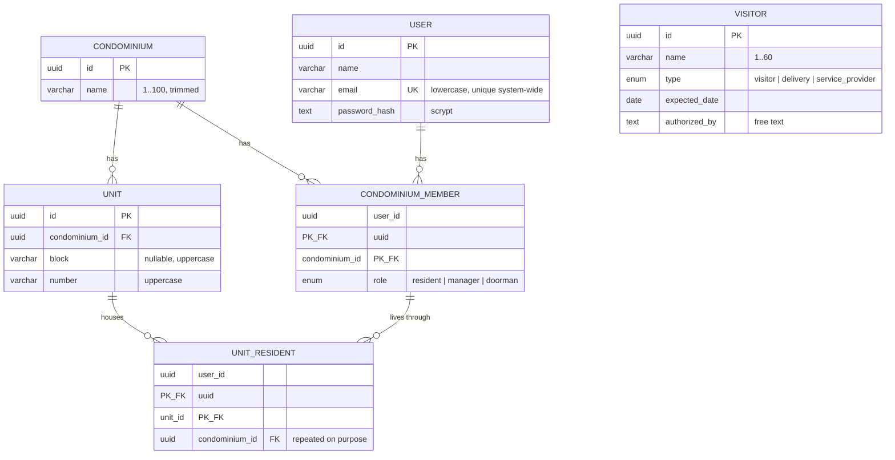

# Data model

**Database:** PostgreSQL 17, container `condfy-db`
([docker-compose.yml](../server/docker-compose.yml)) ·
**Source of truth:** [schema.prisma](../server/prisma/schema.prisma) and the migrations in
[server/prisma/migrations/](../server/prisma/migrations)

Names are English throughout — tables, columns, enum values, code and the JSON contract
([ADR 0008](decisions/0008-english-everywhere.md)). Every table has `created_at`
and `updated_at`, kept by Prisma, except `unit_residents`, which only records `created_at`.

## Diagram

`VISITOR` sits apart in the diagram because it really is apart: it has no foreign key to a
condominium, a unit or a user. That is temporary — the author confirmed the link will be added —
but any query, permission or screen written before then must assume visitors are global. See
[gaps](business-rules.md#inconsistencies-and-gaps-found).

## Entities

### Condominium

The client served by the system and the root of everything that will follow (reservations,
notices, bills). Only fields worth explaining:

| Field | Meaning |
|---|---|
| `name` | Not unique — two condominiums may share a name ([RN-CON-01](business-rules.md#rn-con-01--a-condominium-needs-a-non-empty-trimmed-name)) |

### Unit

An apartment or a house. `block` and `number` are text, not numbers, because real buildings use
`101A` or `Torre Sul`.

| Field | Meaning |
|---|---|
| `block` | `NULL` means the condominium has no blocks. Stored uppercase |
| `number` | Stored uppercase and trimmed, so uniqueness is exact ([RN-UNI-02](business-rules.md#rn-uni-02--block-and-number-are-stored-uppercase-and-trimmed)) |

Two unique indexes protect identity: `(condominium_id, block, number)`, plus a partial one on
`(condominium_id, number) WHERE block IS NULL`, because `NULL` never equals `NULL` in SQL.
There is also a redundant-looking `UNIQUE (id, condominium_id)` — it exists only to be the target
of a composite foreign key from `unit_residents`.

### User

One account per person, for the whole system — not per condominium.

| Field | Meaning |
|---|---|
| `email` | Unique system-wide, stored lowercase and trimmed, format checked by the database |
| `password_hash` | `scrypt$N$r$p$salt$hash` — never the password ([RN-USR-02](business-rules.md#rn-usr-02--the-password-is-never-stored-in-a-readable-or-reversible-form)) |

### CondominiumMember

The membership of a user in a condominium, and where the role lives. The same person can be a
manager in one condominium and a resident in another, which is exactly why the role is here and
not on `User`.

Primary key `(user_id, condominium_id)`; a partial unique index allows at most one `manager` per
condominium ([RN-MEM-02](business-rules.md#rn-mem-02--at-most-one-manager-per-condominium)).

### UnitResident

Who lives where. It points at the *membership*, not at the user, so residency cannot exist
without membership in that unit's condominium.

| Field | Meaning |
|---|---|
| `condominium_id` | Duplicated from the unit on purpose: it ties both composite foreign keys to the same condominium, making a cross-condominium row impossible ([RN-RES-01](business-rules.md#rn-res-01--a-resident-only-lives-in-units-of-a-condominium-they-belong-to)) |

Two deferred constraint triggers enforce that every `resident` membership ends the transaction
with at least one unit ([RN-RES-02](business-rules.md#rn-res-02--every-resident-lives-in-at-least-one-unit)).

### Visitor

Someone a resident expects. The oldest table, created before the condominium model.

| Field | Meaning |
|---|---|
| `expected_date` | `DATE`, a calendar day with no time; converted at the API boundary ([RN-VIS-04](business-rules.md#rn-vis-04--the-date-the-resident-sees-is-the-date-that-was-registered)) |
| `authorized_by` | Free text, not a foreign key to `users` |
| `updated_at` | Always equal to `created_at`, since visitors cannot be edited |

Indexed by `expected_date`, the column the list is always sorted by.

## RefreshToken and LoginAttempt

Added by the authentication feature. Rules in
[Authentication and sessions](business-rules.md#authentication-and-sessions).

There is **no session table**: a session is the chain of renewal credentials belonging to a user.
Each rotation revokes one row and creates the next one, with a new 30-day deadline.

| Table | What it holds |
|---|---|
| `refresh_tokens` | One row per renewal credential ever issued: `user_id`, the SHA-256 `token_hash`, its own `expires_at`, and `revoked_at` (set on rotation, on sign-out, or when a reuse revokes everything) |
| `login_attempts` | The block counter, keyed by `email:…`, `ip:…` or `signup-ip:…`. Not a foreign key: an e-mail that does not exist still has to be counted |

The credential itself is never stored — only its hash — so a leak of the table grants no sessions.
Constraints: `refresh_tokens_expires_after_created`, `login_attempts_attempts_positive`, a
unique index on `token_hash` and an index on `user_id` (used to revoke every credential of a
user at once).

## Where the rules live

The database does more than store: it refuses invalid data. A full list is in
[business rules](business-rules.md#condominiums-units-and-people); the mechanisms are:

| Mechanism | Used for |
|---|---|
| `CHECK` | Trimmed and non-empty names, uppercase unit identifiers, lowercase e-mail with a valid shape |
| Unique index | E-mail; unit identity within a condominium |
| Partial unique index | Unit without block; one manager per condominium |
| Composite foreign key | Residency confined to one condominium |
| `ON DELETE RESTRICT` | Condominium with units or members; unit with residents |
| `ON DELETE CASCADE` | Deleting a user or a membership removes the dependent rows |
| Deferred constraint trigger | "A resident must live in at least one unit", checked at commit |

## Data protection

- Passwords are only ever stored as a `scrypt` derivation, and the stored value records its own
  parameters so they can be strengthened later.
- Names and e-mails are personal data: they must not appear in logs
  ([RN-USR-04](business-rules.md#rn-usr-04--personal-data-never-reaches-the-logs)).
- Deleting a user is permanent and cascades; there is no soft delete and no retention rule.
- The sample data uses e-mails in the reserved `.test` domain, which can never belong to a real
  person, and a single development password defined in
  [seed.ts](../server/prisma/seed.ts) — never reuse it outside local development.

## Migrations

| Migration | What it did |
|---|---|
| `20260921011928_create_visitante` | First visitors table, then named in Portuguese |
| `20260929040257_rename_visitors_to_english` | Renamed table, columns and enum to English, keeping the rows |
| `20260929040409_create_users_condominiums` | Condominiums, units, users, memberships, residency, plus every `CHECK`, partial index and trigger |

Schema changes go through `npx prisma migrate dev`; applied migrations are never edited
([development.md](development.md#changing-the-schema)).
