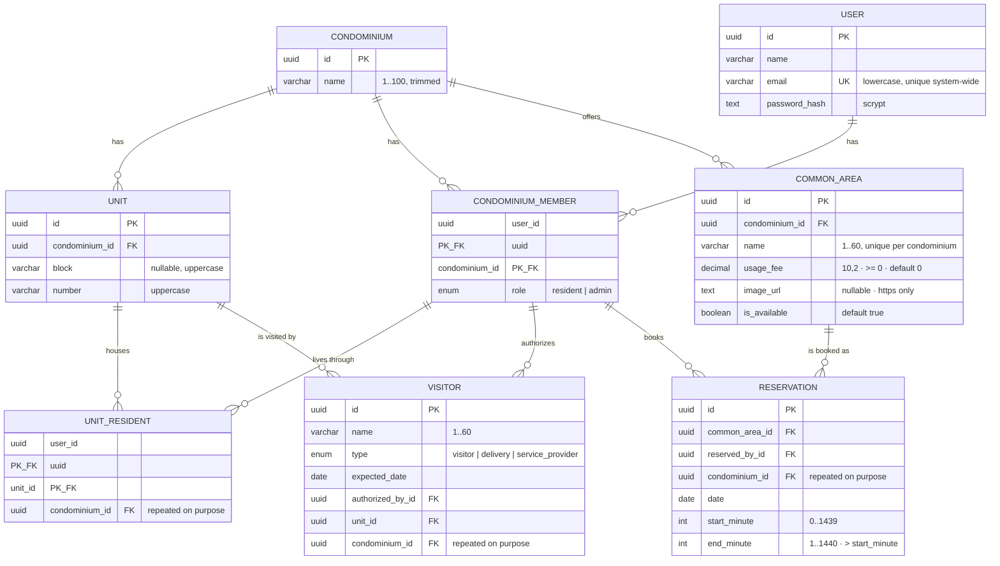

# Data model

**Database:** PostgreSQL 17, container `condfy-db`
([docker-compose.yml](../server/docker-compose.yml)) ·
**Source of truth:** [schema.prisma](../server/prisma/schema.prisma) and the migrations in
[server/prisma/migrations/](../server/prisma/migrations)

Names are English throughout — tables, columns, enum values, code and the JSON contract
([ADR 0008](decisions/0008-english-everywhere.md)). Every table has `created_at`
and `updated_at`, kept by Prisma, except `unit_residents`, which only records `created_at`.

## Diagram

`VISITOR` joined the rest of the model in `link_visitors_to_unit_and_member`. It carries
`condominium_id` for the same reason `UNIT_RESIDENT` does: the column is repeated so that two
composite foreign keys can pin everything to one condominium (research R-002).

The visit points at the **membership**, not at the user and not at the residence. That single
choice decides who may authorize a visit: anyone with a membership in the condominium, which
includes an admin, who lives nowhere in it. Pointing at `UNIT_RESIDENT` instead would
have restricted it to people who live in the very unit being visited
([ADR 0009](decisions/0009-visitors-belong-to-a-unit-and-a-membership.md)).

## Entities

### Condominium

The client served by the system and the root of everything that will follow (reservations,
notices, bills). Only fields worth explaining:

| Field | Meaning |
|---|---|
| `name` | Not unique — two condominiums may share a name ([RN-CON-01](business-rules.md#rn-con-01--a-condominium-needs-a-non-empty-trimmed-name)) |

### Unit

An apartment or a house. `block` and `number` are text, not numbers, because real buildings use
`101A` or `Torre Sul`.

| Field | Meaning |
|---|---|
| `block` | `NULL` means the condominium has no blocks. Stored uppercase |
| `number` | Stored uppercase and trimmed, so uniqueness is exact ([RN-UNI-02](business-rules.md#rn-uni-02--block-and-number-are-stored-uppercase-and-trimmed)) |

Two unique indexes protect identity: `(condominium_id, block, number)`, plus a partial one on
`(condominium_id, number) WHERE block IS NULL`, because `NULL` never equals `NULL` in SQL.
There is also a redundant-looking `UNIQUE (id, condominium_id)` — it exists only to be the target
of a composite foreign key from `unit_residents`.

### User

One account per person, for the whole system — not per condominium.

| Field | Meaning |
|---|---|
| `email` | Unique system-wide, stored lowercase and trimmed, format checked by the database |
| `password_hash` | `scrypt$N$r$p$salt$hash` — never the password ([RN-USR-02](business-rules.md#rn-usr-02--the-password-is-never-stored-in-a-readable-or-reversible-form)) |

### CondominiumMember

The membership of a user in a condominium, and where the role lives. The same person can be a
admin in one condominium and a resident in another, which is exactly why the role is here and
not on `User`.

Primary key `(user_id, condominium_id)`; a partial unique index allows at most one `admin` per
condominium ([RN-MEM-02](business-rules.md#rn-mem-02--at-most-one-admin-per-condominium)).

### UnitResident

Who lives where. It points at the *membership*, not at the user, so residency cannot exist
without membership in that unit's condominium.

| Field | Meaning |
|---|---|
| `condominium_id` | Duplicated from the unit on purpose: it ties both composite foreign keys to the same condominium, making a cross-condominium row impossible ([RN-RES-01](business-rules.md#rn-res-01--a-resident-only-lives-in-units-of-a-condominium-they-belong-to)) |

Two deferred constraint triggers enforce that every `resident` membership ends the transaction
with at least one unit ([RN-RES-02](business-rules.md#rn-res-02--every-resident-lives-in-at-least-one-unit)).

### Visitor

Someone expected at a unit. The oldest table; it predated the condominium model and was attached
to it later.

| Field | Meaning |
|---|---|
| `expected_date` | `DATE`, a calendar day with no time; converted at the API boundary ([RN-VIS-04](business-rules.md#rn-vis-04--the-date-the-resident-sees-is-the-date-that-was-registered)) |
| `authorized_by_id` | The user who authorized the visit. Comes from the token, never from the request body |
| `unit_id` | The unit being visited, tied to `condominium_id` by a composite foreign key |
| `condominium_id` | Repeated on purpose, so both composite foreign keys resolve to the same condominium |
| `updated_at` | Always equal to `created_at`, since visitors cannot be edited |

Two composite foreign keys carry the integrity, so no trigger was needed:

| Constraint | Guarantees |
|---|---|
| `visitors_unit_id_condominium_id_fkey` → `units(id, condominium_id)` | The unit belongs to the visit's condominium |
| `visitors_authorized_by_id_condominium_id_fkey` → `condominium_members(user_id, condominium_id)` | Whoever authorized has a membership in that condominium |

Deleting a membership cascades to the visits that person authorized; a unit cannot be deleted while
visits point at it (`Restrict`), the same asymmetry `unit_residents` uses.

Indexed by `expected_date` (the global list order), by `(condominium_id, expected_date)` for the
per-condominium list that the resident feature will need, and by `(unit_id, condominium_id)`.

### CommonArea

A place inside a condominium that residents can reserve: a party room, a kiosk, a sports court.

| Field | Meaning |
|---|---|
| `usage_fee` | `DECIMAL(10,2)` in BRL. `0` means free to use, never "unknown". The API sends it as a **string** (`"0.00"`), because a JSON number cannot represent every decimal exactly and this is money |
| `image_url` | Web address of the photograph, or `null`. A CHECK requires `https://` — iOS blocks plain HTTP by default, and the failure would look like a broken image with no explanation |
| `is_available` | `false` hides the place from the catalogue **without deleting it**, so a room can be closed for renovation and brought back with its reservations intact |

| Constraint | Guarantees |
|---|---|
| `@@unique([condominium_id, name])` | Two places of the same building cannot share a name — the card shows the name and nothing else, so a resident could not tell them apart |
| `@@unique([id, condominium_id])` | Exists only as the target of `Reservation`'s composite key, the same device `units` uses |
| `common_areas_usage_fee_check` | `usage_fee >= 0` |
| `common_areas_image_url_check` | `image_url IS NULL OR image_url LIKE 'https://%'` |

Indexed by `(condominium_id, is_available)` — the catalogue query, and the only one that exists.

### Reservation

A held slot of a common area. The table exists; **no route writes to it yet**.

| Field | Meaning |
|---|---|
| `date` | The calendar day, like every other date in the project |
| `start_minute` / `end_minute` | Minutes after midnight on the condominium's clock. `840` is 14:00, `1320` is 22:00. End is exclusive |
| `condominium_id` | Repeated on purpose, so both composite foreign keys resolve to one condominium |

**There is no status column.** The row's existence *is* the booking; releasing a slot deletes it. The
trade-off is recorded: the system cannot answer "who booked the party room and gave it up". Approval
by an admin or a cancellation history would be a new column and a new rule.

| Constraint | Guarantees |
|---|---|
| `(common_area_id, condominium_id) → common_areas(id, condominium_id)` | The place belongs to the reservation's condominium |
| `(reserved_by_id, condominium_id) → condominium_members(user_id, condominium_id)` | Whoever booked has a membership in that condominium |
| `reservations_minutes_check` | Ends after it starts, never crosses midnight, never zero-length |

Deleting a membership cascades to that person's reservations; a common area with reservations cannot
be deleted (`Restrict`) — switch `is_available` off instead, which is why that column exists.

#### Why minutes and not a time

A reservation is **civil wall-clock time**: 14:00 on the building's clock, in a system that has no
timezone column and does not want one. An integer cannot be shifted by a serializer, a timezone or a
daylight-saving boundary — which is the same class of bug the project already guards against for
calendar days, in a harder form.

`TIMESTAMPTZ` was rejected because it stores an absolute instant and would need a condominium
timezone. Prisma's `@db.Time` was rejected because it returns a JavaScript `Date` pinned to
1970-01-01, so any local-time read shifts it. Conversion to `"HH:MM"` happens at the API boundary,
where Principle IV puts it: the app never sees a minute count, the database never sees a string.

A `GiST` exclusion constraint would let Postgres refuse overlapping reservations declaratively. It
was not added because nothing can create a reservation yet; it is the natural upgrade when booking is
built.

## RefreshToken and LoginAttempt

Added by the authentication feature. Rules in
[Authentication and sessions](business-rules.md#authentication-and-sessions).

There is **no session table**: a session is the chain of renewal credentials belonging to a user.
Each rotation revokes one row and creates the next one, with a new 30-day deadline.

| Table | What it holds |
|---|---|
| `refresh_tokens` | One row per renewal credential ever issued: `user_id`, the SHA-256 `token_hash`, its own `expires_at`, and `revoked_at` (set on rotation, on sign-out, or when a reuse revokes everything) |
| `login_attempts` | The block counter, keyed by `email:…`, `ip:…` or `signup-ip:…`. Not a foreign key: an e-mail that does not exist still has to be counted |

The credential itself is never stored — only its hash — so a leak of the table grants no sessions.
Constraints: `refresh_tokens_expires_after_created`, `login_attempts_attempts_positive`, a
unique index on `token_hash` and an index on `user_id` (used to revoke every credential of a
user at once).

## Where the rules live

The database does more than store: it refuses invalid data. A full list is in
[business rules](business-rules.md#condominiums-units-and-people); the mechanisms are:

| Mechanism | Used for |
|---|---|
| `CHECK` | Trimmed and non-empty names, uppercase unit identifiers, lowercase e-mail with a valid shape |
| Unique index | E-mail; unit identity within a condominium |
| Partial unique index | Unit without block; one admin per condominium |
| Composite foreign key | Residency confined to one condominium |
| `ON DELETE RESTRICT` | Condominium with units or members; unit with residents |
| `ON DELETE CASCADE` | Deleting a user or a membership removes the dependent rows |
| Deferred constraint trigger | "A resident must live in at least one unit", checked at commit |

## Data protection

- Passwords are only ever stored as a `scrypt` derivation, and the stored value records its own
  parameters so they can be strengthened later.
- Names and e-mails are personal data: they must not appear in logs
  ([RN-USR-04](business-rules.md#rn-usr-04--personal-data-never-reaches-the-logs)).
- Deleting a user is permanent and cascades; there is no soft delete and no retention rule.
- The sample data uses e-mails in the reserved `.test` domain, which can never belong to a real
  person, and a single development password defined in
  [seed.ts](../server/prisma/seed.ts) — never reuse it outside local development.

## Migrations

| Migration | What it did |
|---|---|
| `20260921011928_create_visitante` | First visitors table, then named in Portuguese |
| `20260929040257_rename_visitors_to_english` | Renamed table, columns and enum to English, keeping the rows |
| `20260929040409_create_users_condominiums` | Condominiums, units, users, memberships, residency, plus every `CHECK`, partial index and trigger |

Schema changes go through `npx prisma migrate dev`; applied migrations are never edited
([development.md](development.md#changing-the-schema)).
