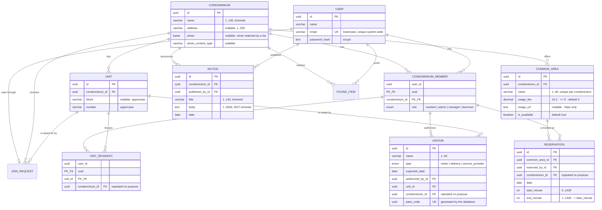

# Data model

**Database:** PostgreSQL 17, container `condfy-db`
([docker-compose.yml](../server/docker-compose.yml)) ·
**Source of truth:** [schema.prisma](../server/prisma/schema.prisma) and the migrations in
[server/prisma/migrations/](../server/prisma/migrations)

Names are English throughout — tables, columns, enum values, code and the JSON contract
([ADR 0008](decisions/0008-english-everywhere.md)). Every table has `created_at`
and `updated_at`, kept by Prisma, except `unit_residents`, which only records `created_at`.

## Diagram

`VISITOR` joined the rest of the model in `link_visitors_to_unit_and_member`. It carries
`condominium_id` for the same reason `UNIT_RESIDENT` does: the column is repeated so that two
composite foreign keys can pin everything to one condominium (research R-002).

The visit points at the **membership**, not at the user and not at the residence. That single
choice decides who may authorize a visit: anyone with a membership in the condominium, which
includes an admin, who lives nowhere in it. Pointing at `UNIT_RESIDENT` instead would
have restricted it to people who live in the very unit being visited
([ADR 0009](decisions/0009-visitors-belong-to-a-unit-and-a-membership.md)).

## Entities

### Condominium

The client served by the system and the root of everything that will follow (reservations,
notices, bills). Only fields worth explaining:

| Field | Meaning |
|---|---|
| `name` | Not unique — two condominiums may share a name ([RN-CON-01](business-rules.md#rn-con-01--a-condominium-needs-a-non-empty-trimmed-name)) |
| `image_url` | Address of the condominium's photo, shown on its card in the chooser and on the home banner. Nullable: without one the app shows a placeholder |

| Constraint | Guarantees |
|---|---|
| `condominiums_image_url_check` | `image_url IS NULL OR image_url LIKE 'https://%'` — the same rule the common areas have |
| `condominiums_address_check` | `address IS NULL OR (address = btrim(address) AND address <> '')` |
| `condominiums_photo_check` | `photo` and `photo_content_type` are both null or both set; the type is JPEG, PNG or WebP; the photo is at most 5 MB |

Since feature 013 a condominium also has an `address` (free text; `NULL` only on the ones that
existed before it could be created from the app) and an uploaded `photo` with its
`photo_content_type`. **No query selects `photo`** except the route that serves it
([RN-CON-05](business-rules.md#rn-con-05--the-photo-of-a-condominium-is-optional-uploaded-from-the-device-and-its-size-is-advice)).
A condominium has a picture from `photo`, from `image_url`, or none.

A **block** is not a table: it is the `block` value its units share. The rule that a block created
from the app has a code of one or two letters is **not** a CHECK, because existing rows have `T1`
and `NULL`; it lives in the validation.

The role enum has four values — `resident`, `admin`, `manager`, `doorman` — and
`condominium_members_one_manager_key` allows at most one síndico per condominium, and
`condominium_members_one_condominium_per_manager_key` — the same partial index on `user_id` — allows
a person to be the síndico of at most one. Each enum value
was added in a migration of its own: Postgres will not let a transaction use an enum value it has
just added ([ADR 0017](decisions/0017-the-sindico-returns-as-a-third-role.md)).

`doorman` returned in feature 014. There is **no** index limiting doormen — a condominium has any
number — and no database rule that a doorman lives in no unit, as there is none for the
administrator or the síndico: the service never creates a residency for them.

The photo is an address, not stored bytes. [ADR 0012](decisions/0012-files-live-in-the-database-and-are-served-by-signed-paths.md)
is about photos taken in the app; nobody uploads this one, it is example data.

**Which condominium a person is currently in is not in the database.** It is a choice kept on the
device for the length of the session and never trusted by the server
([ADR 0013](decisions/0013-the-current-condominium-is-chosen-once-and-is-never-a-permission.md)).

### Unit

An apartment or a house. `block` and `number` are text, not numbers, because real buildings use
`101A` or `Torre Sul`.

| Field | Meaning |
|---|---|
| `block` | `NULL` means the condominium has no blocks. Stored uppercase |
| `number` | Stored uppercase and trimmed, so uniqueness is exact ([RN-UNI-02](business-rules.md#rn-uni-02--block-and-number-are-stored-uppercase-and-trimmed)) |

Two unique indexes protect identity: `(condominium_id, block, number)`, plus a partial one on
`(condominium_id, number) WHERE block IS NULL`, because `NULL` never equals `NULL` in SQL.
There is also a redundant-looking `UNIQUE (id, condominium_id)` — it exists only to be the target
of a composite foreign key from `unit_residents`.

### User

One account per person, for the whole system — not per condominium.

| Field | Meaning |
|---|---|
| `email` | Unique system-wide, stored lowercase and trimmed, format checked by the database |
| `password_hash` | `scrypt$N$r$p$salt$hash` — never the password ([RN-USR-02](business-rules.md#rn-usr-02--the-password-is-never-stored-in-a-readable-or-reversible-form)) |
| `password_is_provisional` | `true` from the creation of the account **by a síndico** until the person changes the password; `false` for every other account. Never set back to `true` — which is what makes the restriction in the token safe ([ADR 0018](decisions/0018-a-provisional-account-carries-a-restriction-in-its-token.md)) |

### CondominiumMember

The membership of a user in a condominium, and where the role lives. The same person can be a
admin in one condominium and a resident in another, which is exactly why the role is here and
not on `User`.

Primary key `(user_id, condominium_id)`; a partial unique index allows at most one `admin` per
condominium ([RN-MEM-02](business-rules.md#rn-mem-02--at-most-one-admin-per-condominium)).

### JoinRequest

Somebody asking to live in one apartment of one condominium (feature 016).

| Field | Meaning |
|---|---|
| `user_id` | Who asks. **Unique**: a person has at most one request. `ON DELETE CASCADE` — it leaves with the account |
| `condominium_id`, `unit_id` | Where. A composite key to `units(id, condominium_id)` guarantees the apartment is of that condominium, as for a visit |
| `created_at` | When it was asked — an **instant** |

Indexed by `(condominium_id, created_at, id)`: the list of a condominium, oldest first.

**There is no status column, on purpose.** A row exists while the request is pending and is deleted
by any answer — approve, reject or withdraw — the way the existence of a reservation is the
booking. That delete is the first statement of every answer, and only the transaction that really
removed the row continues, which is what gives two simultaneous answers one outcome
([ADR 0021](decisions/0021-a-join-request-is-a-row-that-an-answer-deletes.md)).

It is **not** a membership with a "pending" flag: every permission check reads
`condominium_members`, and each would have to remember to skip the pending ones.

### UnitResident

Who lives where. It points at the *membership*, not at the user, so residency cannot exist
without membership in that unit's condominium.

| Field | Meaning |
|---|---|
| `condominium_id` | Duplicated from the unit on purpose: it ties both composite foreign keys to the same condominium, making a cross-condominium row impossible ([RN-RES-01](business-rules.md#rn-res-01--a-resident-only-lives-in-units-of-a-condominium-they-belong-to)) |

Two deferred constraint triggers enforce that every `resident` membership ends the transaction
with at least one unit ([RN-RES-02](business-rules.md#rn-res-02--every-resident-lives-in-at-least-one-unit)).

### Visitor

Someone expected at a unit. The oldest table; it predated the condominium model and was attached
to it later.

| Field | Meaning |
|---|---|
| `expected_date` | `DATE`, a calendar day with no time; converted at the API boundary ([RN-VIS-04](business-rules.md#rn-vis-04--the-date-the-resident-sees-is-the-date-that-was-registered)) |
| `authorized_by_id` | The user who authorized the visit. Comes from the token, never from the request body |
| `unit_id` | The unit being visited, tied to `condominium_id` by a composite foreign key |
| `condominium_id` | Repeated on purpose, so both composite foreign keys resolve to the same condominium |
| `pass_code` | `UUID NOT NULL DEFAULT gen_random_uuid()`, unique (`visitors_pass_code_key`). The code of the visit's pass — what its QR carries. Generated by the **database**, so it holds for every writer; never updated; gone with the row. It is not the `id` on purpose: the API sends every `id` to the administrator, and the code only to whoever authorized the visit ([ADR 0016](decisions/0016-the-visitor-pass-is-a-picture-made-on-the-device.md)) |
| `updated_at` | Always equal to `created_at`, since visitors cannot be edited |

Two composite foreign keys carry the integrity, so no trigger was needed:

| Constraint | Guarantees |
|---|---|
| `visitors_unit_id_condominium_id_fkey` → `units(id, condominium_id)` | The unit belongs to the visit's condominium |
| `visitors_authorized_by_id_condominium_id_fkey` → `condominium_members(user_id, condominium_id)` | Whoever authorized has a membership in that condominium |

Deleting a membership cascades to the visits that person authorized; a unit cannot be deleted while
visits point at it (`Restrict`), the same asymmetry `unit_residents` uses.

Indexed by `expected_date` (the global list order), by `(condominium_id, expected_date)` for the
per-condominium list that the resident feature will need, and by `(unit_id, condominium_id)`.

#### `entered_at`: when the visitor came in

`visitors.entered_at` is a `TIMESTAMPTZ(3)`, `NULL` until the first time the visit's pass is checked
and found valid, then written **once** and never changed
([RN-GAT-02](business-rules.md#rn-gat-02--the-first-valid-check-records-that-the-visitor-came-in-once)).
The only writer is the pass check, through an update conditional on the column still being `NULL`
— which is what makes two simultaneous checks record one entry.

It is an **instant**, in a row whose other date, `expected_date`, is a calendar day. With
`found_items.posted_at` it is one of the two instants in the schema: it travels as full ISO 8601
and is read in local time. There is no table of checks; this column is all a check leaves behind.

### CommonArea

A place inside a condominium that residents can reserve: a party room, a kiosk, a sports court.

| Field | Meaning |
|---|---|
| `usage_fee` | `DECIMAL(10,2)` in BRL. `0` means free to use, never "unknown". The API sends it as a **string** (`"0.00"`), because a JSON number cannot represent every decimal exactly and this is money |
| `image_url` | Web address of the photograph, or `null`. A CHECK requires `https://` — iOS blocks plain HTTP by default, and the failure would look like a broken image with no explanation |
| `is_available` | `false` closes the place to new bookings **without deleting it**, so a room can be closed for renovation and brought back with its reservations intact. Written only by the condominium's administrator, through `PATCH …/common-areas/:id`. The place stays in the catalogue, flagged — it used to be hidden |

| Constraint | Guarantees |
|---|---|
| `@@unique([condominium_id, name])` | Two places of the same building cannot share a name — the card shows the name and nothing else, so a resident could not tell them apart |
| `@@unique([id, condominium_id])` | Exists only as the target of `Reservation`'s composite key, the same device `units` uses |
| `common_areas_usage_fee_check` | `usage_fee >= 0` |
| `common_areas_image_url_check` | `image_url IS NULL OR image_url LIKE 'https://%'` |
| `common_areas_photo_check` | `photo` and `photo_content_type` are both null or both set; the type is JPEG, PNG or WebP; the photo is at most 5 MB |

A place created from the app carries its picture in `photo` (bytes) and `photo_content_type`,
exactly as a condominium does; the sample places keep `image_url`. **No query selects `photo`**
except `readCommonAreaPhoto`.

Indexed by `(condominium_id, is_available)`. The catalogue query it was made for no longer filters
on `is_available` — it lists every place — so only the first column still does work. The index is
left as it is on purpose: dropping it is a migration that buys nothing on a table of a dozen rows.

### Reservation

A held slot of a common area. Written by the booking screen, and the first table in the project
two people can race for.

| Field | Meaning |
|---|---|
| `date` | The calendar day, like every other date in the project |
| `start_minute` / `end_minute` | Minutes after midnight on the condominium's clock. `840` is 14:00, `1320` is 22:00. End is exclusive |
| `condominium_id` | Repeated on purpose, so both composite foreign keys resolve to one condominium |

**There is no status column.** The row's existence *is* the booking; releasing a slot deletes it. The
trade-off is recorded: the system cannot answer "who booked the party room and gave it up". Approval
by an admin or a cancellation history would be a new column and a new rule.

| Constraint | Guarantees |
|---|---|
| `(common_area_id, condominium_id) → common_areas(id, condominium_id)` | The place belongs to the reservation's condominium |
| `(reserved_by_id, condominium_id) → condominium_members(user_id, condominium_id)` | Whoever booked has a membership in that condominium |
| `reservations_minutes_check` | Ends after it starts, never crosses midnight, never zero-length |
| `reservations_slot_grid_check` | `start_minute` is one of the eight grid values and `end_minute` is exactly `start_minute + 120` |
| `UNIQUE (common_area_id, date, start_minute)` | **No double booking**, decided by the database under concurrency ([ADR 0011](decisions/0011-no-double-booking-is-a-unique-index.md)) |

Deleting a membership cascades to that person's reservations; a common area with reservations cannot
be deleted (`Restrict`) — switch `is_available` off instead, which is why that column exists.

#### Why minutes and not a time

A reservation is **civil wall-clock time**: 14:00 on the building's clock, in a system that has no
timezone column and does not want one. An integer cannot be shifted by a serializer, a timezone or a
daylight-saving boundary — which is the same class of bug the project already guards against for
calendar days, in a harder form.

`TIMESTAMPTZ` was rejected because it stores an absolute instant and would need a condominium
timezone. Prisma's `@db.Time` was rejected because it returns a JavaScript `Date` pinned to
1970-01-01, so any local-time read shifts it. Conversion to `"HH:MM"` happens at the API boundary,
where Principle IV puts it: the app never sees a minute count, the database never sees a string.

#### Why a unique index and not an exclusion constraint

The eight-slot grid is fixed — 07:00–09:00 through 21:00–23:00, the same for every place and every
day — and `reservations_slot_grid_check` keeps every row on it. So two bookings of the same slot
carry *the same three column values*, and "no overlapping reservations" becomes "no duplicate key",
which a `UNIQUE` index settles inside the write.

A `GiST` exclusion constraint over a `tsrange` is the general answer, and the right one if periods
were arbitrary. With a fixed grid, overlap can only mean equality, so it would cost `btree_gist`, a
column shape Prisma cannot model and raw SQL in every query to express what the index already
expresses. If per-place opening hours ever make the grid variable, that is when to revisit it
([ADR 0011](decisions/0011-no-double-booking-is-a-unique-index.md)).

#### What the schema cannot hold

A reservation may be made from today up to **60 days ahead**, and that rule is **not** in the
database. A CHECK may only call immutable functions, and "today" is the opposite of immutable, so
the window lives in the service and is checked on both sides.

The split is deliberate rather than an omission: the grid and the uniqueness are properties of the
data, the window is a property of *when the request arrives*. A row 90 days out is odd but harmless;
two rows in one slot is a resident standing outside a locked party room.

### Notice

Something the condominium announced. The first entity whose content is too long to show in a list
row, which is why the preview and the detail screen are separate views of one record.

| Field | Meaning |
|---|---|
| `published_by_id` | The **user** who published — a plain foreign key to `users` since feature 014. Recorded for accountability. The id is **never exposed** by the API; the publisher's display name is, since 2026-10-06 |
| `title` | Stored trimmed, up to 120 characters |
| `body` | Up to 5000 characters, newlines included, and **not** stored trimmed |
| `date` | The calendar day the notice refers to; the list orders by it, newest first |

| Constraint | Guarantees |
|---|---|
| `published_by_id → users(id)`, `ON DELETE RESTRICT` | The publisher is an account that exists, and that account cannot be deleted while the notice does |
| `notices_title_check` | `title = btrim(title) AND title <> ''` |
| `notices_body_check` | `btrim(body) <> '' AND length(body) <= 5000` |

Indexed by `(condominium_id, date DESC, id)` — the list query, and the only one that exists.

#### Why the body is the one column that is not stored trimmed

Every other text column in the project asserts `value = btrim(value)`. The body deliberately does
not: trimming would eat the blank line a writer put between two paragraphs, and preserving those
breaks is a requirement. The CHECK therefore asserts only that the body is not *entirely* whitespace.

#### Why the role is not a database constraint

Only an administrator may publish, and that rule is **not** expressible as a foreign key: a composite
key can require that a membership row exists, not that its `role` column holds a particular value.

A trigger would be worse. The rule belongs to the moment of publishing, not to the row's lifetime —
an administrator being replaced must not retroactively invalidate what they announced.

So the service guarantees the **role**
([ADR 0010](decisions/0010-permission-rules-live-in-the-service.md)). It is the first rule in the
project that the schema cannot hold, and worth remembering as a pattern rather than an exception.

Until feature 014 the database at least guaranteed **membership**, through a composite key to
`condominium_members`. Since then the publisher points at the user, and membership is checked by
the service too — see Deletion below for what that bought.

#### Deletion

Both foreign keys are `Restrict`, a departure from visitors on purpose. A visit is about a person
receiving someone, so it leaves with their membership. A notice is the condominium speaking; losing
the board because an administrator was replaced would be a defect, not a cascade.

**The publisher's key points at `users`, not at the membership**
([ADR 0019](decisions/0019-what-a-person-published-points-at-the-person.md)). When it pointed at
the membership, the `Restrict` did protect the board — by making the membership of anybody who had
published impossible to delete, at a time nothing deleted memberships. Feature 014 lets the síndico
remove people, so the notice now outlives the membership and still refuses the deletion of the
**account**. What was traded: the database no longer proves the publisher belonged to that
condominium; `publishNotice` checks it before writing.

### FoundItem

Something found in the condominium and waiting for its owner: the lost & found shelf. It is the
first entity whose state **changes after it is created**, the first with an **instant** instead of
a calendar day, and the first that keeps a **file**.

| Field | Meaning |
|---|---|
| `posted_by_id` | The user side of the poster's membership. Recorded for accountability, **never exposed** by the API |
| `description` | What the item is. Stored trimmed, up to 200 characters |
| `place` | Where it was found. Stored trimmed, up to 120 characters |
| `status` | The enum `FoundItemStatus`: `found` (the default) or `returned` |
| `posted_at` | `TIMESTAMPTZ`, filled by the database, never accepted from the client |
| `photo` | The image itself, `BYTEA NOT NULL` ([ADR 0012](decisions/0012-files-live-in-the-database-and-are-served-by-signed-paths.md)) |
| `photo_content_type` | Detected by the server from the bytes, never claimed by the uploader |

| Constraint | Guarantees |
|---|---|
| `(posted_by_id, condominium_id) → condominium_members(user_id, condominium_id)` | The poster belongs to the item's condominium |
| `found_items_description_check` | `description = btrim(description) AND description <> ''` |
| `found_items_place_check` | `place = btrim(place) AND place <> ''` |
| `found_items_photo_size_check` | `octet_length(photo)` between 1 and 5 242 880 (5 MB) |
| `found_items_photo_content_type_check` | `photo_content_type` is `image/jpeg`, `image/png` or `image/webp` |

Indexed by `(condominium_id, posted_at DESC, id)` — the list query, and the only one that reads
more than one row.

#### The status is an enum, and that is the whole state machine

Two values, both directions allowed any number of times. So there is no transition to guard: every
value is reachable from every value, and the enum alone guarantees a third cannot be stored by any
means. A new item starts as `found` by the column default.

#### `posted_at` is an instant, unlike every other date here

Every other date in the model is a `DATE` — a calendar day, converted in UTC at the server boundary
and never read in local time. `posted_at` is the opposite case: a moment something happened, which
**must** be read in local time, or an item posted at 21:30 in São Paulo shows as posted the next
day.

It is separate from `created_at` because the column name is the JSON name (ADR 0008), and
`created_at` is bookkeeping every table carries. They hold the same value; only one is contract.

#### The photo is in the row, and no list may select it

`NOT NULL` is what makes an item without a photo impossible, and one `INSERT` is what makes posting
atomic. PostgreSQL moves large values out of the row, so a query that does not name `photo` does not
read it — and every query in the service names its columns. Exactly one function selects the bytes.

The two CHECKs constrain the **label and the size**. That the bytes really are an image of that type
is checked by the server before writing, by file signature; a CHECK cannot read an image format.

#### Why the role is not a database constraint

The same limit as notices: a key can require that a row exists, not that a `role` is `admin`. The
service guarantees **membership and role** — the poster points at `users` since feature 014, like
a notice's publisher
([ADR 0010](decisions/0010-permission-rules-live-in-the-service.md)).

#### Deletion

Nothing deletes a found item in the application. `posted_by_id` points at `users` with `Restrict`,
as on notices and unlike visitors: the shelf is the condominium's, and stays when whoever posted is
removed from it ([ADR 0019](decisions/0019-what-a-person-published-points-at-the-person.md)).

## RefreshToken and LoginAttempt

Added by the authentication feature. Rules in
[Authentication and sessions](business-rules.md#authentication-and-sessions).

There is **no session table**: a session is the chain of renewal credentials belonging to a user.
Each rotation revokes one row and creates the next one, with a new 30-day deadline.

| Table | What it holds |
|---|---|
| `refresh_tokens` | One row per renewal credential ever issued: `user_id`, the SHA-256 `token_hash`, its own `expires_at`, and `revoked_at` (set on rotation, on sign-out, or when a reuse revokes everything) |
| `login_attempts` | The block counter, keyed by `email:…`, `ip:…` or `signup-ip:…`. Not a foreign key: an e-mail that does not exist still has to be counted |

The credential itself is never stored — only its hash — so a leak of the table grants no sessions.
Constraints: `refresh_tokens_expires_after_created`, `login_attempts_attempts_positive`, a
unique index on `token_hash` and an index on `user_id` (used to revoke every credential of a
user at once).

## Where the rules live

The database does more than store: it refuses invalid data. A full list is in
[business rules](business-rules.md#condominiums-units-and-people); the mechanisms are:

| Mechanism | Used for |
|---|---|
| `CHECK` | Trimmed and non-empty names, uppercase unit identifiers, lowercase e-mail with a valid shape |
| Unique index | E-mail; unit identity within a condominium |
| Partial unique index | Unit without block; one admin per condominium |
| Composite foreign key | Residency confined to one condominium |
| `ON DELETE RESTRICT` | Condominium with units or members; unit with residents |
| `ON DELETE CASCADE` | Deleting a user or a membership removes the dependent rows |
| Deferred constraint trigger | "A resident must live in at least one unit", checked at commit |

## Data protection

- Passwords are only ever stored as a `scrypt` derivation, and the stored value records its own
  parameters so they can be strengthened later.
- Names and e-mails are personal data: they must not appear in logs
  ([RN-USR-04](business-rules.md#rn-usr-04--personal-data-never-reaches-the-logs)).
- Deleting a user is permanent and cascades; there is no soft delete and no retention rule.
- The sample data uses e-mails in the reserved `.test` domain, which can never belong to a real
  person, and a single development password defined in
  [seed.ts](../server/prisma/seed.ts) — never reuse it outside local development.

## Migrations

| Migration | What it did |
|---|---|
| `20260921011928_create_visitante` | First visitors table, then named in Portuguese |
| `20260929040257_rename_visitors_to_english` | Renamed table, columns and enum to English, keeping the rows |
| `20260929040409_create_users_condominiums` | Condominiums, units, users, memberships, residency, plus every `CHECK`, partial index and trigger |
| `20261007130001_add_doorman_role` | The `doorman` enum value, alone in its file |
| `20261007130002_point_authors_at_users` | `notices.published_by_id` and `found_items.posted_by_id` now reference `users`, not the membership |
| `20261007130003_add_provisional_password` | `users.password_is_provisional`, `false` for every existing account |
| `20261007140001_add_visitor_entered_at` | `visitors.entered_at`, a nullable instant, `NULL` for every existing visit |
| `20261007150001_one_condominium_per_manager` | A partial unique index on `condominium_members(user_id)` `WHERE role = 'manager'`: one condominium per síndico |
| `20261007160001_add_join_requests` | The `join_requests` table, its unique index on `user_id` and its composite key to `units` |

Schema changes go through `npx prisma migrate dev`; applied migrations are never edited
([development.md](development.md#changing-the-schema)).
