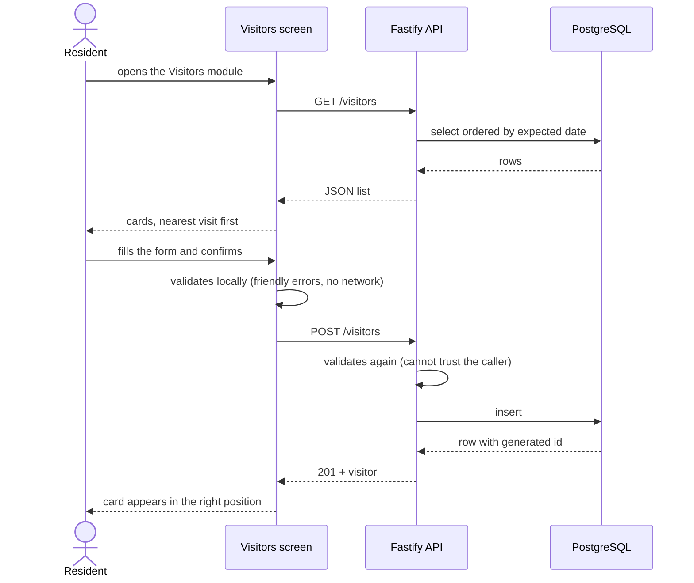

# Product

## Problem and proposal

Condominium life runs on paper notebooks, WhatsApp groups and phone calls: the front desk writes
expected visitors in a book, residents warn the front desk by message, and nobody has a reliable
shared record. condfy replaces that with a single app where each resident registers who they are
expecting, and the people who run the building see the same list.

The visitor module is the first slice. The broader intent, visible in the home screen module list
and in the data model, is one app covering the recurring needs of a condominium: visitors,
reservations of common areas, notices and lost & found.

> ⚠️ Inferred: the problem statement above is reconstructed from the domain vocabulary, the module
> list in [modules.ts](../mobile/features/home/data/modules.ts) and the roles in the data model.
> The repository contains no product brief.

## User roles

Roles are stored per condominium, not per user: the same person can be an admin in one
condominium and a resident in another ([data model](data-model.md#condominiummember)).

| Role (code) | In Portuguese | What they do in the system |
|---|---|---|
| `resident` | morador | Registers and removes the visitors they expect. Must live in at least one unit. Arrives by signing up — choosing their condominium and apartment — and being approved by whoever runs it. |
| `manager` | síndico | Creates the condominium — one, and only somebody who belongs to no condominium can — and is in charge of it. Can do everything the administrator can, and two things alone: creating a place to book and **managing roles** — bringing in the administrator and the doormen. At most one per condominium, and has no unit. |
| `admin` | administrador | Manages the condominium: sees every visitor and authorizes visitors for any unit, switches common areas off and on, publishes notices and found items. At most one per condominium, and has no unit. Appointed and removed by the síndico. |
| `doorman` | porteiro | Works at the gate. Sees every visitor expected in the condominium, without registering or removing any; checks visitors' passes with the camera, which nobody else does; reads the notice board; and consults the reservations — which places exist and whether a day is full — without booking. Has no lost & found. Any number per condominium, and has no unit. Brought in and removed by the síndico. |

Resident, administrator and síndico see the same four modules on the home screen; the síndico also
sees **Roles**, and a doorman sees four: Visitors, Reservations (to consult), Newsletter and
**Pass check**. What differs is inside each
one, and it is the API that decides it — the visitor list, for instance, is the whole condominium's for the
administrator and only the visits they authorized for a resident.

The síndico **returned in feature 013** as a role of its own
([ADR 0017](decisions/0017-the-sindico-returns-as-a-third-role.md)). Before that,
`manager` (síndico) and `doorman` (portaria) had been replaced by the single `admin` role; nobody held
either when the change was made. The **doorman returned in feature 014**, as a role the síndico
gives; its own screens are still to come.

## Features

- **Visitors** — the only module implemented end to end.
  - See the visitors registered for the condominium, sorted by expected date, nearest first.
  - Register a visitor with name, visit type, expected date and the resident who authorized it.
  - Remove a visitor, with an explicit confirmation step.
  - Get a **pass** for each visitor: a square with who authorizes the entry, where, when and a QR
    code of that visit, opened on registering and again from the card, and shared as a picture.
  - Loading, empty and failure states, the last one with a retry action.
  - Rules: [Visitors](business-rules.md#visitors) · Screen:
    [VisitorsScreen.tsx](../mobile/features/visitors/VisitorsScreen.tsx) · API: [api.md](api.md)
- **Condominium data foundation** — no screens yet; data and integrity only.
  - Condominiums, their units (with optional block), user accounts with protected passwords,
    memberships with roles, and residency (which user lives in which unit).
  - Populated for development by a seed command ([development.md](development.md#sample-data)).
  - Rules: [Condominiums, units and people](business-rules.md#condominiums-units-and-people)
- **Roles** — the síndico's module for staffing the condominium.
  - Bring somebody in as administrator or doorman: the síndico creates their account, with a
    provisional password the person must replace at their first sign-in.
  - See who holds which role, change it, set another provisional password, and remove a person —
    which deletes the account that was created for them.
  - Rules: [Roles](business-rules.md#roles) · Screen:
    [StaffScreen.tsx](../mobile/features/staff/StaffScreen.tsx) · API:
    [api.md](api.md#roles-the-staff-resource)
- **Joining a condominium** — how a resident arrives.
  - Signing up asks for the condominium, the block and the apartment, chosen from lists; the
    account waits on an "Awaiting approval" screen.
  - **Requests**, the module of the administrator and the síndico: who is asking, for which
    apartment, since when — approve or reject.
  - Rules: [Joining a condominium](business-rules.md#joining-a-condominium) · Screens:
    [SignUpScreen.tsx](../mobile/features/auth/SignUpScreen.tsx),
    [JoinRequestsScreen.tsx](../mobile/features/joinRequests/JoinRequestsScreen.tsx) · API:
    [api.md](api.md#join-requests)
- **Pass check** — the doorman's module.
  - Read the QR code of a visitor's pass with the camera and be told whether it is valid today, not
    valid yet, expired, or not a pass of this condominium.
  - The first valid check records that the visitor came in; the list of visitors shows it, with the
    time, to everybody who sees that visit.
  - Rules: [The gate](business-rules.md#the-gate) · Screen:
    [PassCheckScreen.tsx](../mobile/features/passCheck/PassCheckScreen.tsx) · API:
    [api.md](api.md#post-condominiumscondominiumidpass-checks)
- **Home** — the condominium at a glance: the everyday modules in a grid, the **latest notice** on
  a card that opens it, and — for whoever is in charge — the administration modules as rows below.
  There is no bottom bar; signing out is in Settings.
  Rules: [The home screen](business-rules.md#the-home-screen).
  [HomeScreen.tsx](../mobile/features/home/HomeScreen.tsx)

## Main journey: expecting a visitor

The remove flow mirrors it: tap the trash icon on a card, confirm in the dialog, `DELETE`, card
disappears. A failure at any point keeps the list untouched and explains what happened.

## Out of scope today

- **Recovering a forgotten password, and confirming a new e-mail by message.** Every change to an
  account asks for the current password, and the system sends no e-mail yet.
- **Changing your name, and handing a condominium to another administrator.** The second is why an
  administrator cannot delete their account today.
- **Screens for condominiums, units and users.** They exist only in the database, created by the
  seed script.
- **Editing a visitor.** Deliberately excluded: correcting a visitor means removing and
  registering it again ([RN-VIS-08](business-rules.md#rn-vis-08--visitors-cannot-be-edited)).
- **Editing or deleting a found item, and claiming one.** The administrator posts an item and
  changes its status; nothing else about it changes, and the app does not record who collected it.
- **Renaming, repricing or deleting a common area, and replacing its photo.** The síndico creates
  a place; after that the only thing that changes is whether it is available.
- **Becoming a síndico through the app.** Sign-up is for residents. The account of somebody who
  will create a condominium is made outside the app, with a script.
- **A history of requests, a reason for a rejection, and notifying anybody** that a request arrived
  or was answered.
- **Removing a resident, moving one to another apartment, and living in two.** A request is for
  one apartment of one condominium.
- **Giving a role to an account that already exists.** A role comes only with a new account: a
  resident who becomes the doorman, or a management company that already uses the app, cannot be
  brought in.
- **Recovering a provisional password after it was replaced, and handing a condominium to another
  síndico.**
- **Running a second condominium with the same account.** A síndico has exactly one; somebody who
  belongs to a condominium with any role cannot create another.
- **Editing or deleting a condominium.** Its name, address, blocks and photo stay as they were
  created.
- **Recording who left, undoing an entry, and a history of checks.** A valid check records that a
  visitor came in, once; nothing records them leaving, nothing unmarks an entry, and the readings
  themselves are not kept.
- **Checking a pass without a doorman.** The síndico and the administrator do not have the module.
- **Notifying anyone.** A resident whose booking the administrator cancels finds out by not seeing
  it in "My bookings" any more.
- **Offline use.** The app needs the server to show anything.
- **Changing a condominium's photo in the app.** A person in several condominiums chooses one at
  sign-in and can switch from the home screen; the photo on each card is example data.

## Glossary

The domain is named in English everywhere — code, JSON contract and database
([ADR 0008](decisions/0008-english-everywhere.md)). The Portuguese column is what a resident or a
an administrator calls each thing in conversation.

| Termo (conversa) | Meaning | In code, contract and database |
|---|---|---|
| Condomínio | The gated community or building served by the system; the root of all data | `Condominium` |
| Unidade | An apartment or house inside a condominium, identified by number and optional block | `Unit` |
| Morador | A person who lives in one or more units of a condominium | role `resident` |
| Administrador | Whoever manages a condominium; at most one per condominium, and has no unit | role `admin` |
| Vínculo | A person's membership in a condominium, carrying the role | `CondominiumMember` |
| Moradia | The record that a person lives in a given unit | `UnitResident` |
| Área comum | A place inside a condominium that residents can reserve: salão, quiosque, quadra | `CommonArea` |
| Aviso | Something the condominium announces to its residents: title, content and a date | `Notice` |
| Reserva | A held slot of a common area, for a day and a time range | `Reservation` |
| Horário | One of the eight fixed two-hour slots a common area can be booked for, 07:00 to 23:00 | `Slot`, `startMinute` / `endMinute` |
| Janela de reserva | How far ahead a booking may go: today plus 60 days, counted in whole days | `BOOKING_WINDOW_DAYS` |
| Comprovante de liberação | The pass of one visit: a square for the visitor with who authorizes, where, when and a QR code | `VisitorPass`, `passCode` |
| Síndico | The person in charge of a condominium, who created it. Shown as "Manager" | `manager` |
| Porteiro | Whoever works at the gate. Shown under their own name, with the label "Doorman" | role `doorman` |
| Cargos | The síndico's module: who works in the condominium, and bringing them in. "Roles" on the screen | `staff` (app feature and API resource) |
| Conferência de comprovante | The doorman reading a visitor's pass with the camera, answered valid, not valid yet, expired or not recognised | `passCheck` (app feature), `pass-checks` (API) |
| Entrada | The moment a visitor came in: the first valid check of their pass | `enteredAt`, `entered_at` |
| Solicitação | Somebody asking to join a condominium as a resident of one apartment; it exists until it is answered | `JoinRequest`, `join_requests` |
| Aguardando aprovação | The state of an account whose request has not been answered: it signs in and sees only that | `joinRequest` in the profile, `pendingRequest` in the app |
| Senha provisória | The password the síndico sets when creating somebody's account; the person must replace it before reaching anything | `passwordIsProvisional` |
| Bloco | A part of a condominium — a tower, a wing — with a code of one or two letters; what groups its units | `block` |
| Local indisponível | A common area the administrator switched off: still listed, but it takes no booking from anyone | `isAvailable: false` |
| Dia inteiro | Every remaining time of one day reserved by the administrator at once — ordinary reservations, all or none | `wholeDayHeld`, `takeWholeDay` |
| Taxa de uso | What the condominium charges to use a common area; zero means free | `usageFee` |
| Configurações | The screen that gathers what belongs to the person rather than to a condominium | `settings` (app feature) |
| Aparência | Light or dark; chosen per device, kept across sign-outs | `appearance`, `scheme` |
| Senha atual | What every change to the account asks for again | `currentPassword` |
| Condomínio atual | The condominium the person chose to act in for this session; kept on the device, never a permission | `selectedCondominiumId`, `currentMembership` |
| Escolha de condomínio | The screen, after sign-in, where someone with more than one condominium picks one | `ChooseCondominiumScreen` |
| Achados e perdidos | The module listing what was found in the building | `lostAndFound` (app feature) |
| Item encontrado | One thing found and waiting for its owner: photo, description, place | `FoundItem` |
| Encontrado | Status of an item still waiting to be collected | `found` |
| Devolvido | Status of an item given back to its owner; it stays listed | `returned` |
| Visitante | Someone a resident expects to receive | `Visitor`, `visitor` |
| Entrega | A delivery (package, food) | `delivery` |
| Prestador | A service provider (plumber, technician) | `service_provider` |
| Data prevista | The calendar day the visitor is expected, no time of day | `expected_date` |
| Autorizado por | Who authorized the visit — a member of the condominium, taken from the token | `authorizedBy`, `authorized_by_id` |
