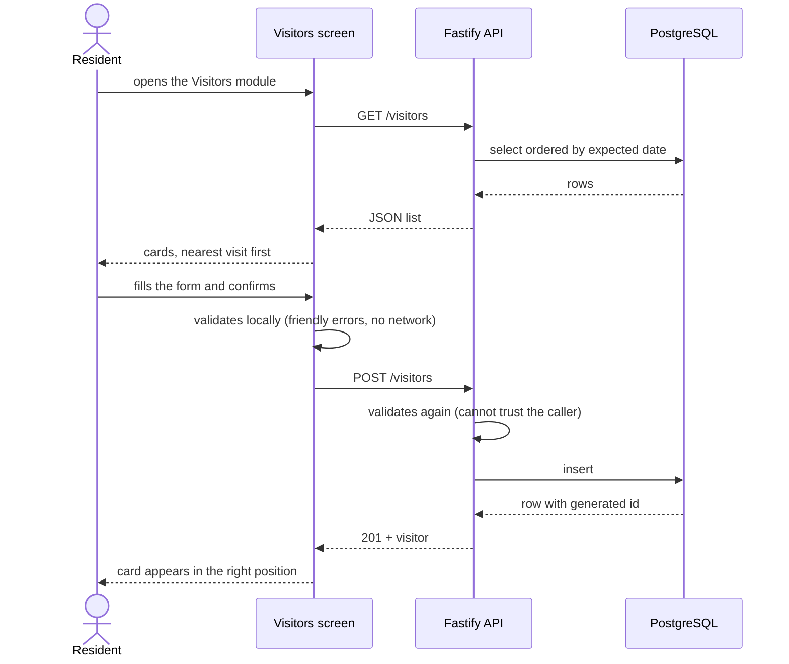

# Product

## Problem and proposal

Condominium life runs on paper notebooks, WhatsApp groups and phone calls: the front desk writes
expected visitors in a book, residents warn the front desk by message, and nobody has a reliable
shared record. condfy replaces that with a single app where each resident registers who they are
expecting, and the people who run the building see the same list.

The visitor module is the first slice. The broader intent, visible in the home screen module list
and in the data model, is one app covering the recurring needs of a condominium: visitors,
reservations of common areas, notices and lost & found.

> ⚠️ Inferred: the problem statement above is reconstructed from the domain vocabulary, the module
> list in [modules.ts](../mobile/features/home/data/modules.ts) and the roles in the data model.
> The repository contains no product brief.

## User roles

Roles are stored per condominium, not per user: the same person can be an admin in one
condominium and a resident in another ([data model](data-model.md#condominiummember)).

| Role (code) | In Portuguese | What they do in the system |
|---|---|---|
| `resident` | morador | Registers and removes the visitors they expect. Must live in at least one unit. |
| `admin` | administrador | Manages the condominium. At most one per condominium, and has no unit. |

The home screen is the first place that branches on role: an `admin` does not see the Visitors
module, because receiving a visitor is something a resident does. That is presentation only — the
API does not yet refuse a route based on role.

`manager` (síndico) and `doorman` (portaria) were replaced by the single `admin` role; nobody held
either when the change was made.

## Features

- **Visitors** — the only module implemented end to end.
  - See the visitors registered for the condominium, sorted by expected date, nearest first.
  - Register a visitor with name, visit type, expected date and the resident who authorized it.
  - Remove a visitor, with an explicit confirmation step.
  - Loading, empty and failure states, the last one with a retry action.
  - Rules: [Visitors](business-rules.md#visitors) · Screen:
    [VisitorsScreen.tsx](../mobile/features/visitors/VisitorsScreen.tsx) · API: [api.md](api.md)
- **Condominium data foundation** — no screens yet; data and integrity only.
  - Condominiums, their units (with optional block), user accounts with protected passwords,
    memberships with roles, and residency (which user lives in which unit).
  - Populated for development by a seed command ([development.md](development.md#sample-data)).
  - Rules: [Condominiums, units and people](business-rules.md#condominiums-units-and-people)
- **Home** — lists the modules of the app and opens the visitor module.
  [HomeScreen.tsx](../mobile/features/home/HomeScreen.tsx)

## Main journey: expecting a visitor

The remove flow mirrors it: tap the trash icon on a card, confirm in the dialog, `DELETE`, card
disappears. A failure at any point keeps the list untouched and explains what happened.

## Out of scope today

- **Login and sessions.** There are no accounts in the app, no token, no permission checks. The
  API is open to anyone on the network.
- **Screens for condominiums, units and users.** They exist only in the database, created by the
  seed script.
- **Editing a visitor.** Deliberately excluded: correcting a visitor means removing and
  registering it again ([RN-VIS-08](business-rules.md#rn-vis-08--visitors-cannot-be-edited)).
- **Reservations, Newsletter, Lost & Found.** Advertised on the home screen, not implemented.
- **Offline use.** The app needs the server to show anything.
- **Multi-condominium in the app.** The database supports a user in several condominiums; the app
  has no notion of "current condominium" yet.

## Glossary

The domain is named in English everywhere — code, JSON contract and database
([ADR 0008](decisions/0008-english-everywhere.md)). The Portuguese column is what a resident or a
an administrator calls each thing in conversation.

| Termo (conversa) | Meaning | In code, contract and database |
|---|---|---|
| Condomínio | The gated community or building served by the system; the root of all data | `Condominium` |
| Unidade | An apartment or house inside a condominium, identified by number and optional block | `Unit` |
| Morador | A person who lives in one or more units of a condominium | role `resident` |
| Administrador | Whoever manages a condominium; at most one per condominium, and has no unit | role `admin` |
| Vínculo | A person's membership in a condominium, carrying the role | `CondominiumMember` |
| Moradia | The record that a person lives in a given unit | `UnitResident` |
| Área comum | A place inside a condominium that residents can reserve: salão, quiosque, quadra | `CommonArea` |
| Aviso | Something the condominium announces to its residents: title, content and a date | `Notice` |
| Reserva | A held slot of a common area, for a day and a time range | `Reservation` |
| Horário | One of the eight fixed two-hour slots a common area can be booked for, 07:00 to 23:00 | `Slot`, `startMinute` / `endMinute` |
| Janela de reserva | How far ahead a booking may go: today plus 60 days, counted in whole days | `BOOKING_WINDOW_DAYS` |
| Taxa de uso | What the condominium charges to use a common area; zero means free | `usageFee` |
| Visitante | Someone a resident expects to receive | `Visitor`, `visitor` |
| Entrega | A delivery (package, food) | `delivery` |
| Prestador | A service provider (plumber, technician) | `service_provider` |
| Data prevista | The calendar day the visitor is expected, no time of day | `expected_date` |
| Autorizado por | Who authorized the visit — a member of the condominium, taken from the token | `authorizedBy`, `authorized_by_id` |
